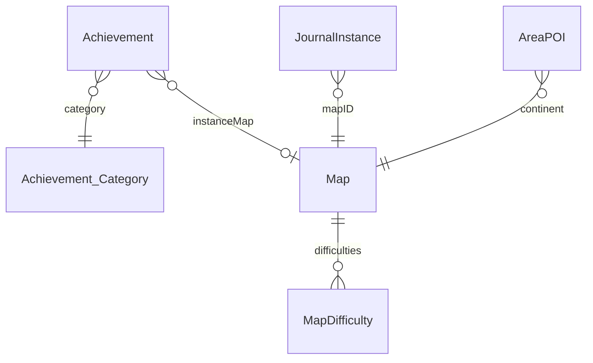

# Achievements DB2 group

Schema for Catalog Journal achievement joins. CSVs sit flat under
[`.wow_db2/`](../). Build pin: see root README. The Achievement / Map / AreaPOI
files in this extract are Wago `12.1.0.69273` (same 12.1.0 patch as the Journal
pin; Wago `69382` CSV was unavailable).

## Relationships

## Table notes

| Table | Role for OneWoW |
| --- | --- |
| `Achievement` | Player achievements. `Instance_ID` is a `Map.ID` for dungeons/raids, **-1** for every delve achievement. |
| `Achievement_Category` | Parent chain. Skip **1 Statistics** and **15076 Guild**. Keep Feats of Strength. |
| `Map` | Delve names (`MapName_lang`), `InstanceType` 5, `ExpansionID` (suite expansion = this + 1). |
| `AreaPOI` | World doors. Description `Delve` (atlas 27121) vs `Bountiful Delve` (27120). |

## Join rules

- **Dungeons / raids:** `Achievement.Instance_ID == JournalInstance.MapID`. Per-raid
  Glory rows that have a MapID already appear. Expansion Glory metas (`Instance_ID = -1`)
  are **not** stamped on every dungeon.
- **Delves:** name match `{MapName} Stories` / `{MapName} Discoveries`, plus
  Glory of the War Within Delver (`40438`) / Glory of the Midnight Delver (`61906`)
  on that expansion's cards, plus matching lair solos (`Let Me Solo Him: Zekvir`,
  `The Underpin`, `Let Me Solo Her: Nexus-Princess Ky'veza`).
- Generator emits IDs (and an English-parsed `diff` token). Runtime uses
  `GetAchievementInfo` for name, points, icon, and status.

## Consumers

- `bin/journal_db2_tools.py` → `Data/Generated/Achievements.lua`,
  `DelveMembership.lua`, `DelveEntrances.lua`
- Runtime: `JournalData` attaches rows to cards; Catalog Journal draws the table.
