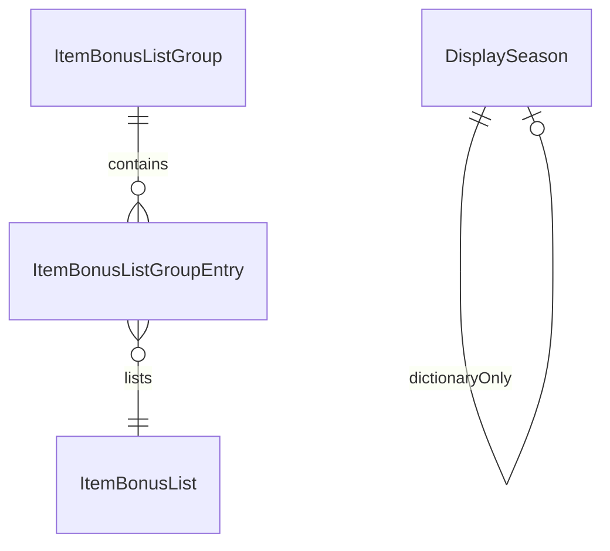

# Item bonus seasons DB2 group

Upgrade-track bonus **list** clusters used to generate frozen search keywords
(`#midnights1`, `#midnights2`, …). CSVs sit flat under [`.wow_db2/`](../).
Journal build pin: see the [root README](../README.md). These tables were added
from a Midnight Season 2 client extract alongside that pin; they are **not**
consumed by `journal_db2_tools.py`.

There is **no** foreign key from a bonus list (or group) to `DisplaySeason.ID`.
Season membership for PvE tracks is a curated group-ID mapping in
[`bin/season_bonus_list_ids.py`](../../bin/season_bonus_list_ids.py).

## Relationships

`DisplaySeason` identifies live seasons (content UID, global M+ `Season`,
per-expansion ordinal) but does not join to `ItemBonusListGroup`.

## Table notes

| Table | Role for OneWoW |
| --- | --- |
| `ItemBonusListGroup` | Track clusters. Midnight S1 groups `607–612` share `PlayerConditionID` 154598; S2 groups `614–618` share 143187. |
| `ItemBonusListGroupEntry` | List IDs on a group plus `SequenceValue`. Rank lists are sequence **1–8**. Sequence 9+ on S1 hero/myth is current-season crafted (Voidforged `13653`/`13654`) — excluded from named-season keywords. |
| `DisplaySeason` | Season dictionary. Midnight S1 = `Season` 17 / ordinal 1 (`ID` 34); S2 = `Season` 18 / ordinal 2 (`ID` 37). `ExpansionID` 11 = Midnight. |

PvP groups `626–630` share the S2 `PlayerConditionID` but `ItemGroupIlvlScalingID` 0. They are **not** in the Midnight PvE mapping.

## Consumers

- `bin/season_bonus_list_ids.py` → `OneWoW/Services/PredicateEngine/season-bonus-lists.lua`
- Runtime: PredicateEngine `#midnights1` / `#midnights2` (bonus-list lookup + tooltip label)

## Cross-model

`DisplaySeason.Season` is the global M+ id used as
`EXPANSION_FIRST_GLOBAL_MPLUS_SEASON` for Midnight (17 = ordinal 1). Tooltip
labels still use `EXPANSION_SEASON_NAME` with the per-expansion ordinal
(`Field_9_2_0_41827_001`), not `DisplaySeason.ID`.
