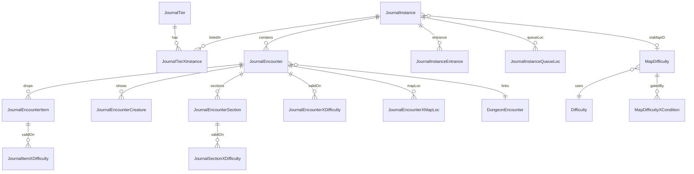

# Journal (Encounter Journal) DB2 group

Schema relationships for the Adventure Guide / Catalog Journal extract set.
CSVs sit flat under [`.wow_db2/`](../). Build pin: see root README.

## Relationships

## Table notes

| Table | Role for OneWoW |
| --- | --- |
| `JournalTier` | Tier list; `Expansion` is `expansionID * 100` (exclude Current Season `9000`). |
| `JournalTierXInstance` | **Which cards exist** per tier (EJ-faithful listing). Dual-list remakes appear twice. |
| `JournalInstance` | Name, `MapID`, `Flags` (`Timewalker=1`, `HideUserSelectableDifficulty=2`, `DoNotDisplayInstance=4`). |
| `JournalEncounter` | Bosses; links `DungeonEncounterID`. |
| `JournalEncounterItem` / `JournalItemXDifficulty` | Live EJ loot corpus (future ATT regen); not required for membership generate. |
| `MapDifficulty` | Valid `DifficultyID`s per `MapID` (drives live scan + dropdown). |
| `Difficulty` | Diff names / max players for labels. |
| `DungeonEncounter` | Combat encounter bridge. |

## Consumers

- `bin/journal_db2_tools.py` → `OneWoW_CatalogData_Journal/Data/Generated/`
- Runtime: `JournalData` (listing), `EJLiveLoot` (valid diffs)

## Cross-model

See [`.wow_db2/README.md`](../README.md) — conditions and MapID links. Achievements
(later) should note shared MapID / dungeon criteria here when added.
