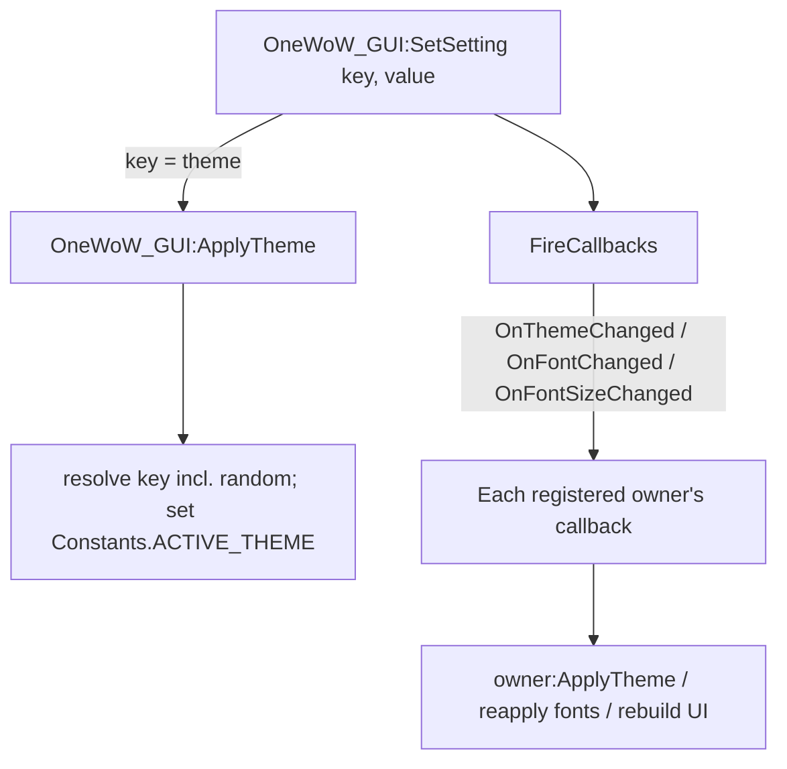

# OneWoW Suite Architecture

Current, implemented architecture of the OneWoW suite: how the load units depend
on each other, how the core loads and initializes them, and the shared
mechanisms they integrate through.

> **Scope:** this document describes *what is implemented today*. Design
> rationale, retired approaches, and future migration steps live in
> [`OneWoW/Docs/Load-Unit-Map.md`](OneWoW/Docs/Load-Unit-Map.md); sections below
> reference it where the "why" matters.

---

## 1. True-core model

The suite ships as separate addons ("load units" / TOCs) but behaves as one
product. `OneWoW_GUI` is the base toolkit and `OneWoW` is the always-loaded core
hub. Every feature module and data store **requires `OneWoW`** and is
`## LoadOnDemand: 1` — nothing auto-loads. The core's orchestrator force-loads
the enabled units at startup and drives their initialization in a deterministic
order (§3). `OneWoW_GUI` self-bootstraps (interim separate addon until absorbed
into core). `OneWoW_Utility_DevTool` is opt-in, `RequiredDeps: OneWoW`, and
receives lifecycle hooks from core dispatch like other manifest units.


---

## 2. TOC dependency summary

Verified against the current `.toc` files.

| Load unit | RequiredDeps | OptionalDeps | LoadOnDemand |
|---|---|---|---|
| **OneWoW_GUI** | — | — | 0 (base, always) |
| **OneWoW** | OneWoW_GUI | Auctionator, TradeSkillMaster | — (always) |
| **OneWoW_QoL** | OneWoW, OneWoW_GUI | — | 1 |
| **OneWoW_Catalog** | OneWoW, OneWoW_GUI | OneWoW_AltTracker, OneWoW_AltTracker_Auctions | 1 |
| **OneWoW_AltTracker** | OneWoW, OneWoW_GUI | — | 1 |
| **OneWoW_Notes** | OneWoW, OneWoW_GUI | — | 1 |
| **OneWoW_Trackers** | OneWoW, OneWoW_GUI | OneWoW_Notes, TradeSkillMaster, Auctionator | 1 |
| **OneWoW_ShoppingList** | OneWoW, OneWoW_GUI | — | 1 |
| **OneWoW_DirectDeposit** | OneWoW, OneWoW_GUI | — | 1 |
| **OneWoW_Bags** | OneWoW, OneWoW_GUI | OneWoW_AltTracker, OneWoW_ShoppingList, TradeSkillMaster, Baganator, Masque | 1 |
| **OneWoW_Utility_DevTool** | OneWoW | !BugGrabber | — |
| **OneWoW_AltTracker_\*** (Storage, Character, Collections, Endgame, Accounting, Professions, Auctions) | OneWoW, OneWoW_GUI, OneWoW_AltTracker | — | 1 |
| **OneWoW_CatalogData_\*** (Journal, Quests, Vendors, Tradeskills) | OneWoW, OneWoW_GUI, OneWoW_Catalog | — | 1 |

---

## 3. Load lifecycle

The core owns *when* a unit loads, *when* it initializes, and *lifecycle event
dispatch*. See Load-Unit-Map §5 for rationale (including why this replaced
`LoadWith` / per-unit `PLAYER_LOGIN` frames).

### 3.1 Orchestrator + manifest

`OneWoW/Core/AddonLoader.lua` holds `OneWoW.ModuleManifest` (every suite unit,
slash command, hub module name, `loadPhase`, and parent `stores`). At the **end
of core's `ADDON_LOADED`** (before `PLAYER_LOGIN`),
`OneWoW.LoadOrchestrator:RunStartupPhase()` walks the manifest, `EnsureLoaded`s
each `loadPhase == "login"` module, then each store. Detect-only entries (e.g.
DevTool) are skipped by the orchestrator but included in login fan-out when loaded.

### 3.2 Event ownership

Only **`OneWoW.lua`** registers `ADDON_LOADED`, `PLAYER_LOGIN`, and
`PLAYER_ENTERING_WORLD` for suite lifecycle dispatch. **`OneWoW_GUI`** still
registers its own `ADDON_LOADED` for self-bootstrap until GUI is absorbed into
core (Load-Unit-Map step 6). Embedded libs are unchanged.

`OneWoW/Core/Lifecycle.lua` implements dispatch and handler registries.

### 3.3 `OnAddonLoaded`

`hooksecurefunc(C_AddOns, "LoadAddOn", …)` in `AddonLoader.lua` calls
`RunPostLoadInit` → `_G[name]:OnAddonLoaded()` for every load path. The hook drives
**`OnAddonLoaded` only** — `OnPlayerLogin` / `OnPlayerEnteringWorld` are driven
separately by `Settle` / `BringUp` (§3.4–3.5) so the whole set is loaded before any
login hook runs. LOD units force-loaded during core's `ADDON_LOADED` never receive
their own WoW `ADDON_LOADED`. Auto-loaded units (DevTool) do; `DispatchAddonLoaded`
also drives their hook.

Data stores use `OneWoW:BootStore(ns, config)` (`Core/StoreBootstrap.lua`) to
expose `OnAddonLoaded` / `OnPlayerLogin` / optional `OnPlayerEnteringWorld`.

### 3.4 `OnPlayerLogin`

At core `PLAYER_LOGIN` (after core service init):
`OneWoW:RunManifestLoginPhase()` walks the manifest and calls `OnAddonLoaded()`
(safety net) then `OnPlayerLogin()` on each loaded unit (login-only — it does not
fire PEW). Mid-session loads go through `OneWoW:BringUp(addon)`, which loads the
whole feature set (`{ addon, ...stores }`, each `OnAddonLoaded` via the hook) and
then runs one `Settle` pass (`OnPlayerLogin` over the set). This guarantees a
parent's `OnPlayerLogin` runs only after its stores are loaded — matching cold
start, where stores load during the orchestrator before the login phase.

### 3.5 `OnPlayerEnteringWorld`

On every `PLAYER_ENTERING_WORLD`, `OneWoW:DispatchEnteringWorld(isLogin, isReload)`
computes `isZoning = not isLogin and not isReload` and fans out to all loaded
manifest units. This real event is authoritative (login, reload, and recurring zone
changes) and is the only PEW source for already-loaded units. A unit loaded
mid-session missed the real event, so `BringUp` (and the lone-load path in the
`LoadAddOn` hook) delivers a synthetic catch-up `OnPlayerEnteringWorld(true, false,
false)`: `isLogin=true` mirrors the cold-start `OnPlayerLogin` → `PEW(isLogin)`
sequence, while `isZoning=false` keeps zone-refresh logic from firing (the player
did not zone). No synthetic PEW is sent at cold start/reload.

### 3.6 Chain-up pattern

Manifest roots call `OneWoW.Lifecycle:CreateHandlerRegistry(self)` in
`OnAddonLoaded`. Sub-modules register with the parent — never with WoW events:

```lua
parent:RegisterLoginHandler("feature", fn)
parent:RegisterEnteringWorldHandler("feature", function(isLogin, isReload, isZoning)
    if isZoning then ... end
end)
parent:RegisterAddonLoadedWatcher("Blizzard_Foo", fn)
```

Parent hooks call `FireLoginHandlers()` / `FireEnteringWorldHandlers()` after
their own work.

| I need to… | Do this | Do NOT |
|------------|---------|--------|
| Init my module DB | `OnAddonLoaded()` on manifest root | `RegisterEvent("ADDON_LOADED")` |
| Arm at login | `OnPlayerLogin()` or `RegisterLoginHandler` | `RegisterEvent("PLAYER_LOGIN")` |
| React to zone change | `OnPlayerEnteringWorld` with `if isZoning` | `RegisterEvent("PLAYER_ENTERING_WORLD")` |
| Hook Blizzard_Foo when it loads | `RegisterAddonLoadedWatcher("Blizzard_Foo", fn)` | Own `ADDON_LOADED` frame |

### 3.7 Deferred addon watches

`OneWoW:RegisterAddonLoadedWatcher(name, fn)` — `name` nil matches any addon.
Prefer `EventUtil.ContinueOnAddOnLoaded` when available.

### 3.8 Loader API (`OneWoW/Core/AddonLoader.lua`)

```lua
OneWoW:EnsureLoaded(name [, opts])              -> ok, reason?
OneWoW:WithAddon(name, onReady, onFail, opts)   -> ok
OneWoW:BringUp(addonName)                        -- load feature + stores, then Settle (+ mid-session PEW catch-up)
OneWoW:GetLoadFailureText(reason)               -> localized string
```

`BringUp` is the single entry point for bringing a manifest feature live (used by
the startup orchestrator and mid-session enables alike). It loads `{ addon,
...stores }` as a batch (`OnAddonLoaded` each), runs one `OnPlayerLogin` pass, and
— only mid-session — fires the synthetic entering-world catch-up (§3.5).

`{ deferInCombat = true }` queues to `PLAYER_REGEN_ENABLED`. See Load-Unit-Map §5.2.

### 3.9 Enable-state API

The two settings surfaces that read/write Blizzard's per-addon enable flag — the
Home tab (`GUI/t-home.lua`) and Manage Features (`Core/FirstRunWizard.lua`) —
share one implementation here instead of hand-rolling parallel helpers.

```lua
OneWoW:IsAddonEnabled(name, perCharacter)        -> boolean
OneWoW:SetAddonEnabled(name, enabled, perCharacter)
OneWoW:IsFeatureWanted(name, perCharacter)         -> boolean
OneWoW:GetFeatureWantedAggregate(name)             -> "all"|"some"|"none"
OneWoW:GetFeatureUnitState(name)                   -> state string
OneWoW:GetAddonStatus(name, perCharacter)        -> status, reason?
OneWoW:IsFeatureOptedOut(name)                     -> boolean
OneWoW:SetFeatureOptOut(name, optedOut, perCharacter)
```

- **Effective wanted state** = Blizzard-enabled in scope AND not soft-opted-out.
  Home and Manage Features both use this model (`GetFeatureUnitState` /
  `IsFeatureWanted`); never hand-roll parallel `GetAddOnEnableState` checks for
  display.
- **`perCharacter` is the scope, chosen per call site.** Manage Features passes
  `true` (current-character scope); account-wide scope uses `false`.
- **`GetAddonStatus` treats loaded / `DEMAND_LOADED` as healthy** — every suite
  unit is `LoadOnDemand: 1`, so `GetAddOnInfo` reports `loadable=false,
  reason="DEMAND_LOADED"` even while loaded and working; that is not an error.
- Enable/disable changes take effect on the next reload/relog (WoW cannot
  load/unload addon Lua mid-session). See Load-Unit-Map §5.3.

---

## 4. Cross-unit sharing model

Because modules are separate load units, they cannot share core's private `ns`
table. Sharing happens through globals published by core and the GUI toolkit:

- **Within a load unit:** `local _, ns = ...` (private upvalue table).
- **Across load units:** plain globals — `_G.OneWoW` (set in `OneWoW.lua:5`),
  the `OneWoW_GUI` toolkit (currently via `LibStub("OneWoW_GUI-1.0")`), and
  members like `OneWoW.OverlayEngine`, `OneWoW.ItemStatus`, `OneWoW.CopyPaste`,
  plus per-unit APIs (e.g. `_G.OneWoW_Catalog_TradeskillAPI`,
  `_G.OneWoW_Trackers_API`).

> LibStub is retained for `OneWoW_GUI` and the vendored Ace libs today. Folding
> `OneWoW_GUI` into core and dropping its LibStub registration is a planned step
> (Load-Unit-Map §6.1), not yet implemented.

---

## 5. Integration mechanisms

### 5.1 ModuleRegistry (hub tab embedding)

Modules that appear as tabs in OneWoW's main window register via
`OneWoW:RegisterModule()` and `OneWoW:RegisterSettingsPanel()`.

**Used by:** AltTracker, Catalog, Notes, QoL, Trackers.

```lua
_G.OneWoW:RegisterModule({
    name = "catalog",
    displayName = function() return ns.L["ADDON_TITLE_SHORT"] end,
    addonName = "OneWoW_Catalog",
    order = 4,
    tabs = {
        { name = "journal", displayName = ..., create = function(p) ns.UI.CreateJournalTab(p) end },
        -- ...
    },
})
```

- `ModuleRegistry` (`OneWoW/Core/ModuleRegistry.lua`) stores `name`,
  `displayName`, `tabs`, `order`.
- When a module tab is selected, `OneWoW/GUI/MainWindow.lua` calls
  `tabInfo.create(frame)` to build content **inside** the hub's content area.
- Content is created lazily and cached in `moduleContentFrames[key]`.

Standalone-window modules (Bags, ShoppingList, DirectDeposit) open their own
frames via slash commands rather than embedding a hub tab.

### 5.2 OneWoW_GUI (shared UI and theme)

All addons use `LibStub("OneWoW_GUI-1.0")` for shared UI creation and theme
colors. Theme is the single source of truth in `OneWoW_GUI_DB`; no addon keeps
its own copy.

**Early-return convention** — every file that depends on OneWoW_GUI starts with:

```lua
local OneWoW_GUI = LibStub("OneWoW_GUI-1.0", true)
if not OneWoW_GUI then return end
```

Fail fast — no defensive `if OneWoW_GUI and OneWoW_GUI.SomeMethod then` guards.

**Component API:** all creation uses `(parent, options)`. See `OneWoW_GUI/GUI.md`
for the full reference, and Load-Unit-Map / the `onewow-gui-ui` skill for policy.

**Database API:** `OneWoW_GUI.DB` provides SavedVariable utilities
(`MergeMissing`, `Ensure`, `Read`, `Set`, `Init`, `RunMigrations`). See the
`onewow-database-api` skill for the full surface.

### 5.3 Settings change broadcast

`OneWoW_GUI` owns the shared settings (`OneWoW_GUI_DB`) and broadcasts changes.
Consumers subscribe with `OneWoW_GUI:RegisterSettingsCallback(event, owner, fn)`;
`OneWoW_GUI:SetSetting(key, value)` writes the value and fires the matching
event(s) via the internal `FireCallbacks`:

| `SetSetting` key | Side effect | Event(s) fired |
|---|---|---|
| `theme` | calls `OneWoW_GUI:ApplyTheme()` | `OnThemeChanged` |
| `font` | — | `OnFontChanged` |
| `fontSizeOffset` | — | `OnFontSizeChanged` **and** `OnFontChanged` |

The dual fire on `fontSizeOffset` is deliberate: a consumer that only listens for
`OnFontChanged` still re-renders when the offset changes, so subscribing to font
size is optional.



- **`ApplyTheme(addon)`** resolves the active theme key from the settings sources
  (handling the `random` theme as a per-session pick) and sets
  `Constants.ACTIVE_THEME` — the single source consumers read colors from.
- **Who subscribes:** effectively every feature module (and many QoL submodules)
  registers `OnThemeChanged`; most also register `OnFontChanged`. The top-level
  modules each define their own `:ApplyTheme()` that their `OnThemeChanged`
  handler invokes. The exact subscriber set is intentionally not enumerated here
  (it changes as modules are added) — `rg 'RegisterSettingsCallback'` is the
  source of truth.
- The hub itself runs `GUI:FullReset()` on theme change to rebuild its window.

### 5.4 Profile apply

Loading a saved profile (`GUI/t-profiles.lua`) reapplies **theme** and
**language** to the already-loaded modules without a reload, via
`SyncSettingToChildAddons(settingType, value)`. It iterates a fixed list of
integrated addons (`OneWoW_AltTracker`, `OneWoW_Notes`, `OneWoW_QoL`,
`OneWoW_Catalog`, `OneWoW_DirectDeposit`, `OneWoW_ShoppingList`, DevTool) and
calls `addon:ApplyTheme()` / `addon:ApplyLanguage()` where present, then
`GUI:FullReset()`. Font and font-size offset are not part of profile sync.

### 5.5 Font sizing funnel

All suite font application funnels through `OneWoW_GUI:SafeSetFont(fontString,
fontPath, size, flags)`. It adds the global `fontSizeOffset` to the requested
size with a hard floor:

```lua
adjustedSize = math.max(6, (size or 12) + offset)
```

Key details:
- Stored in `OneWoW_GUI_DB.fontSizeOffset` (default `0`); range `-3`..`+5`
  (enforced in the settings stepper). `OneWoW_GUI:GetFontSizeOffset()` returns it.
- `SafeSetFont` falls back to the stock font (then `GameFontNormal`) if the target
  font is unusable, so a fontstring is never left without a font.
- Changing the offset fires `OnFontSizeChanged` + `OnFontChanged` (§5.3); consumers
  reapply fonts / rebuild UI in response.

---

## 6. Cross-addon references

| From | To | Mechanism | Purpose |
|---|---|---|---|
| OneWoW | OneWoW_Bags | `OneWoW/Integrations/OneWoW_Bags.lua` | Registers the overlay engine with Bags' item-button callbacks |
| OneWoW_ShoppingList | OneWoW_Catalog | `_G.OneWoW_Catalog_TradeskillAPI` | Recipe callback when Catalog's tradeskill data is loaded |
| OneWoW_Trackers | OneWoW_Notes | `_G.OneWoW_Trackers_API` | Trackers exposes an API; Notes adds a tracker sub-tab |
| OneWoW_Trackers | OneWoW_Notes_DB | One-time migration | Migrates legacy tracker data out of Notes' SavedVariables |

---

## 7. File reference summary

| File | Purpose |
|---|---|
| `OneWoW/Core/AddonLoader.lua` | Load orchestrator, `ModuleManifest`, `EnsureLoaded`/`WithAddon`, enable-state API |
| `OneWoW/Core/Lifecycle.lua` | Lifecycle dispatch, handler registries, addon-loaded watchers |
| `OneWoW/Core/StoreBootstrap.lua` | `OneWoW:BootStore` for data stores |
| `OneWoW/Core/ModuleRegistry.lua` | Hub tab/module registration and lifecycle |
| `OneWoW/Core/FirstRunWizard.lua` | First-run picker + Manage Features panel (per-character enable/disable) |
| `OneWoW/GUI/t-home.lua` | Home tab: account-wide enable/disable + status display |
| `OneWoW/GUI/MainWindow.lua` | Hub window; builds registered module tabs lazily |
| `OneWoW/Docs/Load-Unit-Map.md` | Design rationale, retired mechanisms, and future migration steps |
