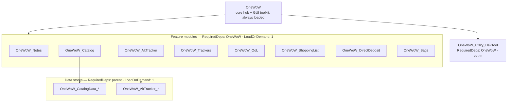

# OneWoW Suite Architecture

Authoritative reference for how the suite is partitioned, loaded, enabled, and
integrated. Describes **what is implemented today**.

Remaining migration work (GUI absorption, SV migration, QoL feature moves,
DevTool packaging, enforcement ramp) lives in [`MIGRATION.md`](MIGRATION.md)
(steps 7–11).

---

## 1. True-core model

The suite ships as **separate addons** (load units / TOCs) but behaves as one
product. `OneWoW` is the always-loaded hub and contains the shared UI toolkit
(the `OneWoW_GUI` global, absorbed from the former `OneWoW_GUI` addon — §8.1).
Feature modules and data stores are `## LoadOnDemand: 1` with
`RequiredDeps: OneWoW` — nothing auto-loads except core. The orchestrator
force-loads enabled units at startup and drives initialization in deterministic
order (§3).

A transitional `OneWoW_GUI` TOC-only stub remains on disk solely to load the
legacy `OneWoW_GUI_DB` SavedVariables file (`MIGRATION.md` step 7). Step 8
folded that data into `OneWoW_DB` (versioned `fold_gui_db` migration); the
stub ships for a release or two more so late upgraders still migrate, then is
deleted in step 7.2.

### Why separate TOCs (not one mega-addon)

Manage Features uses `C_AddOns.DisableAddOn` + `ReloadUI` to **truly unload** heavy
modules and multi-MB data tables. A single literal TOC would parse every file at
login; disabling could only skip runtime work — Lua and data stay resident. **Per-module
TOCs preserve real unload.**

Distribution is one package / one install; **load units stay many**. Separate
CurseForge pages were the tracking burden, not separate folders.



---

## 2. Load-unit tiers and TOC summary

| Tier | Units | Loads | Mechanism |
|---|---|---|---|
| **1 — Core hub** | `OneWoW` | Always | Orchestrator, Manage Features, hub UI, shared engines, GUI toolkit (`OneWoW_GUI` global) |
| **2 — Feature modules** | AltTracker, Catalog, Notes, Trackers, QoL, ShoppingList, DirectDeposit, Bags | On demand | `RequiredDeps: OneWoW` + `LoadOnDemand: 1` |
| **3 — Data stores** | `OneWoW_AltTracker_*`, `OneWoW_CatalogData_*` | On demand, after parent | `RequiredDeps: …, <parent>` + `LoadOnDemand: 1`; listed in `ModuleManifest.stores` |
| **4 — Utility** | `OneWoW_Utility_DevTool` | Opt-in | `RequiredDeps: OneWoW`; excluded from recommended preset |

Verified against current `.toc` files:

| Load unit | RequiredDeps | OptionalDeps | LoadOnDemand |
|---|---|---|---|
| **OneWoW** | OneWoW_GUI *(transitional SV stub — see §1)* | Auctionator, TradeSkillMaster | — |
| **OneWoW_GUI** *(stub)* | — | — | 0 |
| **OneWoW_Notes** | OneWoW | — | 1 |
| **OneWoW_AltTracker** | OneWoW | — | 1 |
| **OneWoW_Catalog** | OneWoW | — | 1 |
| **OneWoW_Trackers** | OneWoW | TradeSkillMaster, Auctionator | 1 |
| **OneWoW_QoL** | OneWoW | — | 1 |
| **OneWoW_ShoppingList** | OneWoW | — | 1 |
| **OneWoW_DirectDeposit** | OneWoW | — | 1 |
| **OneWoW_Bags** | OneWoW | TradeSkillMaster, Baganator, Masque | 1 |
| **OneWoW_Utility_DevTool** | OneWoW | !BugGrabber | — |
| **OneWoW_AltTracker_\*** | OneWoW, OneWoW_AltTracker | — | 1 |
| **OneWoW_CatalogData_\*** | OneWoW, OneWoW_Catalog | — | 1 |

### OptionalDeps policy

**Do not use `## OptionalDeps` for suite-internal features.** Blizzard auto-loads
enabled OptionalDeps when the consumer is `LoadAddOn`'d — bypassing soft opt-out
and the login orchestrator. Suite integrations use nil-guards at call sites and,
for explicit user actions, `OneWoW:WithAddon` / `EnsureLoaded` (§3.8).

External third-party addons (TSM, Auctionator, Baganator, Masque, `!BugGrabber`)
remain valid OptionalDeps.

---

## 3. Load lifecycle

Core owns *when* a unit loads, *when* it initializes, and lifecycle event dispatch.
Handler fans (`Register*Handler`, addon-loaded watchers, scan callbacks) isolate
failures via `pcall` and forward errors through `geterrorhandler()` so one handler
cannot break the fan-out yet errors still surface.

### 3.1 Why core-driven loading (retired `LoadWith`)

`LoadWith` auto-loads a dependency inside the parent's load. When
`C_AddOns.LoadAddOn` runs inside another addon's `ADDON_LOADED`, WoW does **not**
deliver the loaded module's own `ADDON_LOADED` — its DB setup never ran. Stores are
listed under each parent in `ModuleManifest.stores`; the orchestrator `EnsureLoaded`s
each explicitly after the parent, driving `OnAddonLoaded` deterministically.

Precedent: DBM loads mods with `LoadAddOn` then runs core-driven post-load init —
same pattern as our `OnAddonLoaded` hook.

### 3.2 Orchestrator + manifest

`OneWoW/Core/AddonLoader.lua` holds `OneWoW.ModuleManifest` (every suite unit,
slash command, hub `module` name, hub `tabOrder`, `loadPhase`, parent `stores`).
At the **end of core's `ADDON_LOADED`** (before `PLAYER_LOGIN`),
`OneWoW.LoadOrchestrator:RunStartupPhase()` walks the manifest in **array order**
and calls `OneWoW:BringUp(addon)` for each `loadPhase == "login"` entry (feature
+ stores as one set). DevTool is detect-only — skipped by the orchestrator but
included in login fan-out when loaded.

**Load order** is manifest array order. **Hub row-1 tab order** is the explicit
`tabOrder` field on entries with `module` (Notes → AltTracker → Catalog →
Trackers → QoL today). `GetModuleTabOrder` / `GetAlwaysShowModules` read
`tabOrder`; missing or unknown module names fall back to 99. New hub modules must
set both `module` and `tabOrder`.

```lua
{ addon = "OneWoW_Notes", module = "notes", tabOrder = 1, loadPhase = "login", ... }
```

### 3.3 Event ownership

Only **`OneWoW.lua`** registers `ADDON_LOADED`, `PLAYER_LOGIN`, and
`PLAYER_ENTERING_WORLD` for suite lifecycle dispatch. The GUI toolkit's settings
bootstrap (`OneWoW_GUI:InitializeSettings()` in `GUI/Settings.lua`) is called
from core's `OnAddonLoaded` — it no longer self-registers `ADDON_LOADED`.
Embedded `Libs/` are unchanged.

| Registrar | Allowed? |
|-----------|----------|
| `OneWoW.lua` | Yes — sole lifecycle authority for manifest units |
| Embedded `Libs/` | Yes — third-party, off-limits |
| Feature modules, stores, DevTool, sub-modules | **No** — chain up to manifest parent |

Orchestrated units may still `RegisterEvent` for **gameplay** WoW events (`PLAYER_ALIVE`,
`BAG_UPDATE`, `ZONE_CHANGED`, …). Only the three **lifecycle** events above must route
through core dispatch. For data stores, entering-world collection belongs in `BootStore`
`onEnteringWorld` (or `RegisterEnteringWorldHandler` on the store namespace), not a raw
`PLAYER_ENTERING_WORLD` frame.

### 3.4 `OnAddonLoaded`

All unit `OnAddonLoaded` paths funnel through `OneWoW:DispatchUnitOnAddonLoaded`
(`Core/Lifecycle.lua`), which dispatches the hook **at most once per unit per
session**. Three drivers call it:

1. `hooksecurefunc(C_AddOns, "LoadAddOn", …)` → `RunPostLoadInit` →
   `DispatchUnitOnAddonLoaded` (primary path for force-loaded LoD units).
2. `OneWoW:DispatchAddonLoaded` for auto-loaded manifest units that receive WoW's
   own `ADDON_LOADED`.
3. `OneWoW:RunManifestLoginPhase` as a safety net at `PLAYER_LOGIN` for units
   whose hook was somehow not driven by the LoadAddOn path — repeat calls are a
   no-op thanks to the central guard.

The LoadAddOn hook drives **`OnAddonLoaded` only** — `OnPlayerLogin` /
`OnPlayerEnteringWorld` are driven by `Settle` / `BringUp` (§3.5–3.6). LoD units
force-loaded during core's `ADDON_LOADED` never receive their own WoW
`ADDON_LOADED`.

**Dispatch is manifest-gated.** `DispatchUnitOnAddonLoaded` only runs the hook
for `ModuleManifest` units (roots and their `stores`), checked via
`OneWoW:IsManifestUnit` (`Core/AddonLoader.lua`). A Blizzard or third-party
addon whose `_G` table happens to define `OnAddonLoaded` is never treated as a
suite load unit; a suppressed would-have-run hook records `dispatch.skip`
(§3.11). Addon-loaded **watchers** (§3.4.1) remain ungated — they observe every
addon load, manifest or not.

Data stores use `OneWoW:BootStore(ns, config)` (`Core/StoreBootstrap.lua`).

### 3.4.1 Addon-available notification (watchers)

`RegisterAddonLoadedWatcher(addonName, fn)` is the "wire when addon X becomes
available" primitive — the suite analogue of WoW's `ADDON_LOADED`. Fan-out runs
through `OneWoW:NotifyAddonLoadedWatchers`, gated **at most once per addon name per
session**. Two drivers feed it, mirroring the two real load paths:

1. WoW `ADDON_LOADED` → `OneWoW:DispatchAddonLoaded` → `NotifyAddonLoadedWatchers`.
2. Any `C_AddOns.LoadAddOn` (orchestrator force-load, `BringUp`, on-demand) →
   `RunPostLoadInit` → `NotifyAddonLoadedWatchers`.

Both drivers run the manifest unit's `OnAddonLoaded` (via
`DispatchUnitOnAddonLoaded`) **before** the watcher fan-out, so a watcher can rely
on the loaded unit's init having completed.

**Registration-time catch-up:** a filtered watcher whose addon already loaded
before the watcher registered (e.g. external bag addons that sort alphabetically
before `OneWoW`, so their `ADDON_LOADED` already fired) runs `fn` immediately at
registration. This catch-up is deliberately independent of the per-session dedup
set, so a late registrant still fires exactly once. Combined with idempotent setup
guards in the watcher body, this makes wiring order-insensitive across cold start,
mid-session enable, and already-loaded cases.

**Wildcard watchers (`addonName = nil`/`"*"`) observe every load, by design.** This
mirrors WoW's `ADDON_LOADED`, under which every addon is notified of every other
addon's load. The pre-fix gap was that suite LoD units force-loaded inside core's
`ADDON_LOADED` had their own child `ADDON_LOADED` suppressed by WoW (§3.1), so
wildcard watchers silently missed them. Routing `RunPostLoadInit` through
`NotifyAddonLoadedWatchers` restores WoW-native completeness: a wildcard watcher now
sees suite-internal force-loads too. Wildcard watchers get no registration catch-up
(there is no single addon to replay) — they observe loads from registration onward.

Use watchers for "wire when addon X is available." Use `RegisterCoreLoginHandler`
only for login-scoped work unrelated to addon load — **not** as an "if addon loaded
at login" check, which misses mid-session and force-load paths.

### 3.5 `OnPlayerLogin`

At core `PLAYER_LOGIN`: `OneWoW:FireCoreLoginHandlers("early")` (feature inits),
then the load banner, then `OneWoW:FireCoreLoginHandlers("late")` (integrations),
then `OneWoW:RunManifestLoginPhase()` walks the manifest and calls
`DispatchUnitOnAddonLoaded` (safety net; no-op when already run) then `OnPlayerLogin()`
on each loaded unit.

**Core login handlers are phased.** `RegisterCoreLoginHandler(id, fn, phase)`
takes `phase = "early"` (before the load banner — core feature `Initialize()`
calls, registered at the bottom of each feature file) or `"late"` (default —
after the banner; external-addon integrations like Bagnon, toast wiring).

**Handlers within a phase must be order-independent.** A handler that needs
another subsystem initialized must express that in code (call it, or make the
dependency lazy/idempotent) — never rely on registration (TOC load) order. This
is what lets a handler relocate to another load unit without ordering
regressions.

Mid-session loads use `OneWoW:BringUp(addon)`: loads `{ addon, ...stores }`, then one
`Settle` pass (`OnPlayerLogin` over the set) so a parent's login runs only after its
stores are loaded — matching cold start.

### 3.6 `OnPlayerEnteringWorld`

On every `PLAYER_ENTERING_WORLD`, `OneWoW:DispatchEnteringWorld(isLogin, isReload)`
computes `isZoning = not isLogin and not isReload` and fans out to all loaded
manifest units.

Mid-session loads missed the real event; `BringUp` (and the lone-load path in the
`LoadAddOn` hook) delivers synthetic catch-up `OnPlayerEnteringWorld(true, false,
false)`: `isLogin=true` mirrors cold start; `isZoning=false` avoids spurious zone
refresh. No synthetic PEW at cold start/reload.

### 3.7 Chain-up pattern

Manifest roots call `OneWoW.Lifecycle:CreateHandlerRegistry(self)` in
`OnAddonLoaded`. Sub-modules register with the parent — never with WoW events:

```lua
parent:RegisterLoginHandler("feature", fn)
parent:RegisterEnteringWorldHandler("feature", function(isLogin, isReload, isZoning)
    if isZoning then ... end
end)
parent:RegisterAddonLoadedWatcher("Blizzard_Foo", fn)
```

| I need to… | Do this | Do NOT |
|------------|---------|--------|
| Init my module DB | `OnAddonLoaded()` on manifest root | `RegisterEvent("ADDON_LOADED")` |
| Arm at login | `OnPlayerLogin()` or `RegisterLoginHandler` | `RegisterEvent("PLAYER_LOGIN")` |
| React to zone change | `OnPlayerEnteringWorld` with `if isZoning` | `RegisterEvent("PLAYER_ENTERING_WORLD")` |
| Hook Blizzard_Foo when it loads | `RegisterAddonLoadedWatcher("Blizzard_Foo", fn)` | Own `ADDON_LOADED` frame |

### 3.8 Loader API

```lua
OneWoW:EnsureLoaded(name [, opts])              -> ok, reason?
OneWoW:WithAddon(name, onReady, onFail, opts)   -> ok
OneWoW:BringUp(addonName)                        -- load feature + stores, then Settle (+ mid-session PEW catch-up)
OneWoW:GetLoadFailureText(reason)               -> localized string
```

- **Soft opt-out enforced:** returns `"OPTED_OUT"` when unit or parent store's parent
  is opted out. Explicit user loads (Blizzard "Load Addon", Manage Features per-row
  button) clear opt-out via the post-hook.
- **`{ deferInCombat = true }`** queues to `PLAYER_REGEN_ENABLED`.
- **Lazy cross-module data:** reserve `WithAddon` for *explicit user actions* (e.g.
  Catalog AH scan → `OneWoW_AltTracker_Auctions`), not speculative tab opens.
- **Trackers → Notes migration** uses `WithAddon("OneWoW_Notes", …)` when Notes is
  wanted but not loaded; defers when Notes is soft-opted-out.
- **The funnel is mandatory.** Raw `C_AddOns.LoadAddOn` / `UIParentLoadAddOn` calls
  are forbidden everywhere except `Core/AddonLoader.lua` and `Core/Lifecycle.lua` —
  they bypass soft opt-out and combat deferral, and skip load tracing. This applies
  to Blizzard LoD addons too (`EnsureLoaded("Blizzard_InspectUI")` works for them;
  opt-out policy simply never matches). Enforced by pre-commit `no-raw-loadaddon`
  (§3.10); rare legitimate exceptions use `-- noqa: loadaddon` on the line.

### 3.9 Load phases

| Phase | When loaded | Use for |
|---|---|---|
| `login` | End of core `ADDON_LOADED` if wanted | Passive hooks: tooltips, overlays, toasts, automations |
| `lazy` | First hub tab / window open | Pure-window modules with no passive behavior |

All manifest entries are `login` today. `lazy` defers until `EnsureModuleForTab` in
`MainWindow` (dormant while everything is `login`).

### 3.10 Enforcement

| Rule | Mechanism |
|---|---|
| No lifecycle `RegisterEvent` in orchestrated units | `bin/check_suite_lifecycle.py` (pre-commit `no-suite-lifecycle-events`) |
| No raw `LoadAddOn` outside the loader funnel (§3.8) | `bin/check_no_raw_loadaddon.py` (pre-commit `no-raw-loadaddon`) |
| No suite-internal `OptionalDeps` | `bin/check_toc_optional_deps.py` (pre-commit `no-suite-internal-optionaldeps`) |
| No direct `db.global.settings` access (§8.5) | `bin/check_no_settings_bypass.py` (pre-commit `no-settings-bypass`) |
| No cross-family store global reads | `bin/check_no_data_manager_bypass.py` (phased; see MIGRATION step 11) |
| No `_G.literal` access | `bin/check_no_g_literal.py` |
| Agent guidance | `.cursor/rules/OneWoW-Suite-Architecture.mdc`, `onewow-suite-architecture` skill |

### 3.11 Lifecycle trace (`/1wtrace`)

`Core/Lifecycle.lua` carries an opt-in tracer that records the dispatch/load
sequence into an in-memory ring buffer (`Lifecycle.Trace`, 1024 entries) and
prints it to chat. It exists to answer "is the lifecycle doing what we think?"
in-game — there is otherwise no visibility into the success path of dispatch.

| Command | Action |
|---|---|
| `/1wtrace on` | Enable recording (clears ring), persist the flag |
| `/1wtrace off` | Disable recording (persist) |
| `/1wtrace clear` | Clear the ring |
| `/1wtrace dump` | Print the buffer, oldest-first, as a `[+Δs] phase unit detail` timeline |
| `/1wtrace` | Usage + current recording state |

`/owtrace` is an alias. Strings are hardcoded English (dev tool, not user-facing
UI — same precedent as Bags' `/owblayout`).

**Capturing startup is the design constraint.** The whole orchestration
(`RunStartupPhase` → `BringUp` → `LoadAddOn` hook → `RunManifestLoginPhase` →
`DispatchEnteringWorld`) runs inside core's `ADDON_LOADED`, before any command
can be typed. So the **enable flag persists** in `OneWoW_DB.global.debugTrace` (default
`false`, in `Core/Database.lua` defaults) and is read back by `Trace:Sync()` in
`OneWoW:OnAddonLoaded` right after `InitializeDatabase` — before the orchestrator
runs. Workflow: `/1wtrace on` → `/reload` → `/1wtrace dump`. The **ring is
session-only** (cleared each `Sync`), so a dump always reflects the current
session. `Dump` prints `min(count, RING_SIZE)` lines.

`OneWoW:TraceRecord(phase, unit, detail)` is the single record API — a cheap
no-op when disabled — called from the lifecycle funnels in `Lifecycle.lua` and
`AddonLoader.lua`. Recorded phases:

| Phase | Source | Meaning |
|---|---|---|
| `startup.begin` / `startup.end` | `RunStartupPhase` | Orchestrator login-phase pass bounds |
| `bringUp.begin` / `bringUp.end` | `BringUp` | Feature+stores batch (`midSession`, `units`, `loaded`) |
| `ensureLoaded` / `ensureLoaded.skip` | `EnsureLoaded` | Load outcome (`ok`, `reason`) or skip (`OPTED_OUT`/`COMBAT`) |
| `loadAddOn.hook` | `LoadAddOn` post-hook | Every load path's single chokepoint (`inBringUp`) |
| `OnAddonLoaded` / `OnPlayerLogin` / `OnPlayerEnteringWorld` | `Lifecycle.RunUnitHook` | Per-unit hook **fires** (recorded only when the hook exists); defined in `Lifecycle.lua`, called from `AddonLoader.lua` too |
| `dispatch.skip` | `DispatchUnitOnAddonLoaded` | Manifest gate suppressed a non-manifest unit's `OnAddonLoaded` (`reason=NOT_MANIFEST`; recorded only when the hook exists) |
| `optOut.clear` | `AddonList_LoadAddOn` post-hook | Blizzard addon-list Load button cleared a per-character soft opt-out (`scope`, `source`) |
| `watchers.notify` / `watcher.catchup` | `NotifyAddonLoadedWatchers`, registration catch-up | Addon-loaded watcher fan-out and late-registrant replay |
| `manifest.loginPhase` | `RunManifestLoginPhase` | Login walk start |
| `core.loginHandlers` / `core.enteringWorldHandlers` | `FireCore*Handlers` | Core handler fans (`count`; login records once per `phase` — `early` then `late`) |
| `enteringWorld` | `DispatchEnteringWorld` | Real PEW (`isLogin`, `isReload`, `isZoning`) |
| `catchUpPEW` | `CatchUpEnteringWorld` | Synthetic mid-session PEW catch-up (attempted per unit) |
| `defer.combat` / `combat.flush` | `WithAddon`, combat frame | Combat-deferred load queue/flush |
| `error` | `SafeCall` failure | Handler-fan failure, in sequence (complements DevTool ErrorLogger) |

`catchUpPEW` fires for every unit in the set while `OnPlayerEnteringWorld` only
follows for units that implement the hook — the pair reads as attempt-vs-actual.

---

## 4. Enable model

Two layers:

1. **Blizzard per-addon enable** (`C_AddOns.{Enable,Disable}AddOn`) — hard layer.
   Disabling truly unloads after reload. Re-enabling a login-disabled unit needs
   reload (`LoadAddOn` returns `DISABLED` mid-session).

2. **Soft opt-out** (`OneWoW_DB.global.featureOptOut`) — unit stays Blizzard-enabled;
   orchestrator skips loading. Can `LoadAddOn` later same session with no reload.

| Action | Mechanism | Reload? |
|---|---|---|
| Soft disable (Apply) | set `featureOptOut`; orchestrator skips next load | No (loaded unit stays until reload) |
| Soft enable | clear opt-out + `EnsureLoaded` / Load Addon | No |
| Hard disable (Apply & Reload) | `DisableAddOn` + clear opt-out + `ReloadUI` | Yes |
| Hard re-enable | `EnableAddOn` + `ReloadUI` | Yes |
| Load at login | orchestrator `BringUp` during core `ADDON_LOADED` | n/a |

Scope: Manage Features selects account vs current character for both layers. Home is
**read-only** — links to Manage Features for writes.

**Opt-out clears at the intent source, never in the generic load path.** The
`C_AddOns.LoadAddOn` post-hook runs init for every load but makes no policy
decisions about persisted state — a programmatic load (ours or a third-party
addon force-loading a suite unit) never alters the user's opt-out; the unit runs
for that session and the persisted choice survives the next reload. Each
explicit-enable surface owns its own clear:

| Explicit-enable surface | Who clears opt-out |
|---|---|
| Manage Features soft Apply / hard Apply / "Load now" | `FirstRunWizard.lua` writes `SetFeatureOptOut` per selection |
| Blizzard addon-list **Load Addon** button | `hooksecurefunc("AddonList_LoadAddOn", …)` in `Core/AddonLoader.lua` (char scope; traced as `optOut.clear`) |

Accepted tradeoff: the addon-list hook names a Blizzard FrameXML function. If a
future patch renames `AddonList_LoadAddOn`, the button silently stops clearing
opt-out — the unit still loads and inits via the generic hook, and Manage
Features remains the in-suite path to clear opt-out.

### 4.1 Enable-state API

```lua
OneWoW:IsAddonEnabled(name, perCharacter)
OneWoW:SetAddonEnabled(name, enabled, perCharacter)
OneWoW:IsFeatureWanted(name, perCharacter)         -- Blizzard-enabled AND not opted out
OneWoW:GetFeatureWantedAggregate(name)             -> "all"|"some"|"none"
OneWoW:GetFeatureUnitState(name)                   -> state string
OneWoW:GetAddonStatus(name, perCharacter)
OneWoW:IsFeatureOptedOut(name)
OneWoW:SetFeatureOptOut(name, optedOut, perCharacter)
```

**`GetFeatureUnitState` return values:**

| State | Meaning |
|---|---|
| `missing` | Addon not installed |
| `disabled` | Blizzard-disabled for current character |
| `not_loaded` | Wanted but not in memory (or soft-disabled, not loaded) |
| `pending_disable` | Soft-disabled but still loaded this session; drops next reload |
| `all` | Loaded; wanted on every known character |
| `some` | Loaded; mixed enable/opt-out across characters |

**`GetAddonStatus`** treats `IsAddOnLoaded` / `DEMAND_LOADED` as healthy — LoD units
force-loaded by the orchestrator report `loadable=false, reason="DEMAND_LOADED"` even
while working.

Manage Features' `FirstRun.CATALOG[].datastores` (consumer graph) and
`ModuleManifest.stores` (ownership graph) remain **distinct** sources of truth.

### 4.2 Home tab live refresh

`UI/t-home.lua` builds module rows once; each row's `ApplyState()` re-reads
`GetFeatureUnitState`. `MainWindow` registers `EventRegistry` on
`OneWoW.FeatureStateChanged` (fired from `SetFeatureOptOut` and post-`LoadAddOn` hook)
to call `GUI:RefreshHomeStatus()` while Home is visible.

Visual mapping: green = fully wanted; grey = mixed across chars; amber check =
not loaded or `pending_disable` (tag `(off next reload)` for the latter); red X =
Blizzard-disabled.

---

## 5. Hub UI

### 5.1 ModuleRegistry

Modules that appear as row-1 tabs register via `OneWoW:RegisterModule()`:

```lua
_G.OneWoW:RegisterModule({
    name = "catalog",
    displayName = function() return ns.L["ADDON_TITLE_SHORT"] end,
    addonName = "OneWoW_Catalog",
    order = OneWoW:GetModuleTabOrder("catalog"),
    tabs = { ... },
})
```

`ModuleRegistry` stores `name`, `displayName`, `tabs`, `order`. `MainWindow.lua`
calls `tabInfo.create(frame)` lazily; content cached in `moduleContentFrames`.

**Cached content is stale by default.** A tab frame is built once; revisiting it
just `Show()`s the cached frame. `MainWindow` calls `frame:Activate()` on every
tab selection and `frame:Deactivate()` when leaving — tabs whose content can
change while hidden must implement `Activate` to re-render. Portals (secure
overlay + grid layout) and the Overlays/Tooltips settings tabs (re-render the
feature list and selected detail pane with fresh registry reads, which keeps the
tooltips/`gearupgrades` ↔ overlays/`upgrade` mirror visually synced) do this
today.

**Placeholder tabs:** when a hub module is not loaded, `GetAlwaysShowModules()` still
shows its tab (same `tabOrder`, locale key label). Selecting a placeholder prompts load or
Manage Features.

Standalone-window modules (Bags, ShoppingList, DirectDeposit) open via slash commands,
not hub tabs.

### 5.2 Pin pattern

A sub-addon may register both a hub tab and a standalone window. The **Pin** pattern
in `ModuleRegistry` promotes a hub item to a small standalone window — user-controlled,
shared theme/GUI primitives.

---

## 6. Cross-unit sharing

Modules cannot share core's private `ns`. Sharing uses globals:

- **Within a load unit:** `local _, ns = ...`
- **Across load units:** `_G.OneWoW`, the `OneWoW_GUI` global (toolkit), per-unit
  APIs (`OneWoW_Catalog_TradeskillAPI`, `OneWoW_Trackers_API`), store `_API` /
  `_DB` globals.

LibStub is retained only for vendored Ace libs (`LibStub`, `CallbackHandler-1.0`,
`LibDataBroker-1.1`, `LibDBIcon-1.0`, `LibSharedMedia-3.0`). The copy/paste
dialog service is `OneWoW.CopyPaste` (`Core/CopyPaste.lua` — `MIGRATION.md`
step 7.1).

### Cross-addon references

| From | To | Mechanism | Purpose |
|---|---|---|---|
| OneWoW | OneWoW_Bags | `Integrations/OneWoW_Bags.lua` (wired via `RegisterAddonLoadedWatcher`) | Overlay engine with Bags callbacks |
| OneWoW_ShoppingList | OneWoW_Catalog | `OneWoW_Catalog_TradeskillAPI` | Recipe callback |
| OneWoW_Trackers | OneWoW_Notes | `OneWoW_Trackers_API` | Tracker sub-tab in Notes |
| OneWoW_Trackers | OneWoW_Notes_DB | One-time migration | Legacy tracker data drain |

### Store access rules

Every cross-module store read is nil-guarded. Prefer `_API` over `_DB`. Core reads
stores opportunistically (tooltips, overlays) — never as a load trigger.

### Core service roster (post MIGRATION step 9)

Engines and shared detection are **core services** on `_G.OneWoW`; **feature
content registers in from QoL** (or other units). With QoL opted out, the
services stay resident — only the QoL-registered content disappears. All service
files live under `OneWoW/Services/` (a single TOC block; consumers reference the
`OneWoW.*` table, never the path).

| Service | File | Consumed by |
|---|---|---|
| `OneWoW.PredicateEngine` | `Services/PredicateEngine.lua` | Bags (search/categories), AltTracker, ShoppingList, DirectDeposit, QoL; core overlay + tooltip engines |
| `OneWoW.OverlayEngine` | `Services/overlay-engine.lua` | Bag integrations (core `Integrations/*`), `OneWoW_Bags` |
| `OneWoW.OverlayIcons` | `Services/overlay-icons.lua` | Overlay engine rendering, QoL overlays tab |
| `OneWoW.TooltipEngine` | `Services/tooltip-engine.lua` | Provider registration from QoL, Bags, DirectDeposit |
| `OneWoW.Toasts` | `Services/toast-engine.lua` | Toast types from QoL, `OneWoW_Notes` `Fire*Alert` |
| `OneWoW.ItemStatus` | `Services/itemstatus.lua` | Overlay engine, Bags |
| `OneWoW.UpgradeDetection` | `Services/upgrade-detection.lua` | Overlay engine, Bags |
| `OneWoW.RecipeKnownUtil` | `Services/RecipeKnownUtil.lua` | Overlay engine, tooltip providers |
| `OneWoW.ItemPrices` | `Services/ItemPrices.lua` | Tooltip providers, overlay engine |
| `OneWoW.Locale` | `Services/LocaleService.lua` | Every addon (each registers its own scope, reads back a view) — see Localization below |

Feature content that registers in from QoL: settings catalogs
(`SettingsFeatureRegistry:Register`, e.g. `tooltips`, `overlays`), tooltip
providers (`TooltipEngine:RegisterProvider`), toast types, the Portal Hub, and
the hub settings tabs (`RegisterModule` row-2 tabs). Settings **storage** stays
in core `OneWoW_DB` (`settings.*` defaults in `Core/Database.lua`);
`SettingsFeatureRegistry` resolves storage without a catalog entry, so core
services keep reading feature settings with QoL opted out.

### Localization (`OneWoW.Locale`)

One service owns localization for the whole suite (`Services/LocaleService.lua`),
modeled on `OneWoW_GUI:ApplyTheme` / `Constants.ACTIVE_THEME` (a metatable
`__index` fallback chain with `__newindex = noop`).

- **Scopes.** Core fills the `shared` scope (suite-wide keys: themes, language
  names, common buttons) and its own `OneWoW` scope. Every other addon registers
  its **own scope keyed by `ADDON_NAME`** (the file's first vararg — no magic
  strings): `OneWoW.Locale:Register(ADDON_NAME, locale, { ... })` at locale-file
  load, then `ns.L = OneWoW.Locale:GetTable(ADDON_NAME)`. The view is
  **identity-stable** (same table for the session) and **read-only**, so a cached
  `local L = ns.L` never goes stale across a language change.
- **Resolution order:** scope → `shared` → **the key name itself** (a miss returns
  its own name, never `nil`, so missing keys are visible in-game). Therefore **do
  not write `L[key] or "fallback"`** — that masks misses. For genuinely optional
  strings (localize if present, else a dynamic value) use
  `OneWoW.Locale:GetOptional(scope, key)` (returns the value or `nil`).
- **Disjoint contract:** a key is EITHER shared OR scoped, never both. `/owlocale`
  (the sole locale-debug command — no debug builds) reports per-scope key counts,
  shared/scope collisions, and locales not in `SUPPORTED`.
- **Language switching is centralized.** `OneWoW.Locale:SetLanguage(lang)` refolds
  every scope **in place** (so cached views update), fires `OnApply` listeners
  (for UI rebuilds), and pushes any `BINDING_*` keys to `_G` (keybinding labels).
  Core calls it once on `OnLanguageChanged` (then `FullReset`s the hub) and once on
  profile apply (`t-profiles`) — addons must **not** loop their own `SetLanguage`.
  `Locale.SUPPORTED` (ordered code+native) drives the picker; `Locale.ALIASES`
  normalizes client locales (`enGB`→`enUS`; esMX is its own SUPPORTED locale, not aliased).
- **`GetStore(scope)`** returns the raw `{[locale]={K=v}}` for consumers needing a
  specific locale's strings (import/export, or dev `"TEST"` GetStore placeholders that
  source their key set from the registered enUS store).
- **QoL external modules** use a per-module scope `ADDON_NAME .. "." .. id` (e.g.
  `OneWoW_QoL.afkpanel`), set up by `ModuleRegistry:Define`/`Current()` — see the
  QoL `DEVELOPERS.md`. Cross-module string access goes through
  `ModuleRegistry:GetById("<id>")`, never a shared global.

This is the **contract**. For the day-to-day practitioner guide — the locale tooling
(`bin/locale_*`, `/owlocale`), the routing decision (Blizzard global → shared → scoped),
what is intentionally *not* translated and why, and Blizzard-term alignment — see
[`LOCALES.md`](LOCALES.md).

---

## 7. Taxonomy

| Kind | Definition | Examples |
|---|---|---|
| **Sub-addon** | Separate TOC / load unit | `OneWoW_Catalog`, `OneWoW_AltTracker_Storage` |
| **Feature** | User-facing capability in a sub-addon | Journal tab, AH scanner, bag bar |
| **Provider** | Registered data source with lifecycle/SV | Future `DataManager` providers |
| **Service** | Near-stateless utility on `_G.OneWoW` | `OverlayEngine`, `CopyPaste` (target) |

**Hub vs contextual:** hub = tabs in OneWoW window; contextual = own window in
gameplay context (Bags, ShoppingList, DirectDeposit, DevTool). Not binary — modules
may register both.

### Layering rules

1. **No sub-addon reads another family's store global directly.** Lint:
   `bin/check_no_data_manager_bypass.py` (phased enforcement — see `MIGRATION.md`
   step 11).
2. **Inverse dependencies via events/callbacks**, not direct calls — core stays
   consumer-agnostic.
3. **Cross-unit data** should route through `DataManager:Query` (planned broker in
   core — not yet implemented). Consumers ask; providers register; empty when absent.

**Promotion discipline:** second consumer → promote to core. Provider → `Providers/`;
stateless utility → `Services/` on `_G.OneWoW`. Rule of Three before abstracting.

---

## 8. GUI and settings integration

### 8.1 OneWoW_GUI

The shared UI toolkit lives in `OneWoW/GUI/` and is published as the plain
global **`OneWoW_GUI`** (`GUI/Core.lua`). Theme is single source of truth in
`OneWoW_DB` (`OneWoW_GUI:InitializeSettings` binds the toolkit's settings
handle to core's db). Every unit that loads has `RequiredDeps: OneWoW`, so the
global is guaranteed present — take a local handle, no guard:

```lua
local OneWoW_GUI = OneWoW_GUI
```

Fail fast — no defensive nil-chain guards on methods.

**Component API:** `(parent, options)`. See `OneWoW/Docs/GUI.md` and the
`onewow-gui-ui` skill for policy.

**Database API:** `OneWoW_GUI.DB` — see `onewow-database-api` skill.

### 8.2 Settings change broadcast

`OneWoW_GUI:SetSetting(key, value)` writes and fires callbacks:

| Key | Side effect | Event(s) |
|---|---|---|
| `theme` | `ApplyTheme()` | `OnThemeChanged` |
| `font` | — | `OnFontChanged` |
| `fontSizeOffset` | — | `OnFontSizeChanged` + `OnFontChanged` |

Hub runs `GUI:FullReset()` on theme change.

### 8.3 Profile apply

`UI/t-profiles.lua` reapplies theme and language via `SyncSettingToChildAddons` —
iterates integrated addons and calls `ApplyTheme()` / `ApplyLanguage()` where present,
then `GUI:FullReset()`. Font/size not part of profile sync.

### 8.4 Font sizing

All font application funnels through `OneWoW_GUI:SafeSetFont(fontString, fontPath,
size, flags)` with `fontSizeOffset` from `OneWoW_DB` (range −3..+5, floor 6).

### 8.5 Core settings funnel (`SettingsFeatureRegistry`)

All reads and writes of `OneWoW.db.global.settings.*` (tooltips, overlays,
toastalerts) route through `OneWoW.SettingsFeatureRegistry`
(`Core/SettingsFeatureRegistry.lua`). Only that file and `Core/Database.lua`
(defaults, migrations) touch the tree directly — enforced by the
`no-settings-bypass` pre-commit hook (§3.10). `portalHub` is a separate DB
root outside the funnel (follow-up before MIGRATION step 9c); the former
`toasts` root was folded into `settings.toastalerts` in MIGRATION step 9a
(migration v5), including the storage-only `anchor` id (no catalog row).

The toast engine (`Services/toast-engine.lua`, `OneWoW.Toasts`) stays resident
in core; its surface includes the notes `Fire*Alert` wrappers consumed
cross-unit by `OneWoW_Notes`. Toast *types* (loot, instance), the settings
catalog, and the toastalerts tab live in `OneWoW_QoL`.

Three responsibilities:

- **Catalog** — `Register` / `GetByTab` feature metadata for the settings GUI.
- **Storage path** — `ResolveStorage` applies the `settingsTab`/`settingsId`
  mirror protocol (a feature registered on one tab can store under another,
  e.g. tooltips/`gearupgrades` → overlays/`upgrade`), then delegates all
  reads/writes to `OneWoW_GUI.DB` primitives (`Read`/`Ensure`/`Set`/
  `MergeMissing`). Settings are global-scope only.
- **Notification** — mutators fire `RegisterListener` callbacks with
  **storage-resolved** coordinates `(storageTab, storageId, key, value)`;
  bulk changes (`ResetTab`) fire with nil storageId/key. The registry holds no
  engine references — subscribers register themselves.

```lua
local reg = OneWoW.SettingsFeatureRegistry
reg:IsEnabled(tab, id)          reg:SetEnabled(tab, id, value)
reg:GetSetting(tab, id, key)    reg:SetSetting(tab, id, key, value)
reg:GetFeatureSettings(tab, id) -- live table, READ-ONLY by contract (hot paths)
reg:IsIntegrationEnabled(key)   reg:SetIntegrationEnabled(key, value)
reg:GetOverlaySetting(id, key)  reg:SetOverlaySetting(id, key, value)
reg:ResetTab(tab)               reg:RegisterListener(id, fn)
```

**Subscribers (pub/sub, replaces caller-driven refresh):**

| Listener | Trigger | Action |
|---|---|---|
| `OverlayEngine` | `storageTab == "overlays"` | `RequestRefresh()` — coalesced repaint (50 ms debounce; `Refresh()` stays the immediate API) |
| `ExternalTooltipSync` | `("tooltips", "value")` change | `SyncAll()` — Auctionator/TSM tooltip suppression |

GUI code never calls `OverlayEngine:Refresh()` or `ExternalTooltipSync:SyncAll()`
after a settings write — the notification covers it. This includes writers in
other load units (`OneWoW_Bags` settings, `OneWoW_Trackers` farm panel).

Scalar `Set*` calls early-return on no-change (no write, no notification). Table
values are always written and notified — pass a new table, not a mutated one
obtained from `GetFeatureSettings`.

`ExternalTooltipSync` runtime state (Auctionator column backup, one-time popup
flags) lives in its own `db.global.externalTooltipSync` root, not in settings —
relocated by a versioned `DB:RunMigrations` step in `Core/Database.lua`.

---

## 9. Caveats

- **Runtime nil-guards** remain the backstop; lint checks are additive, not compile-time.
- **Stores expose `_DB` and `_API`:** cross-module consumers should prefer `_API`; direct
  `_DB` reads are a refactor target.
- **`DEMAND_LOADED` is normal** for force-loaded LoD units — not an error state.
- **Secret values (12.0+):** combat-related data may be opaque in instances; use Blizzard
  templates for combat UI rather than branching on secret values from tainted code.
- **Mid-session hard enable** always needs reload; soft layer exists specifically to avoid
  that for reload-free toggles.

---

## 10. File reference

| File | Purpose |
|---|---|
| `OneWoW/Core/AddonLoader.lua` | Manifest, orchestrator, `BringUp`/`EnsureLoaded`, enable API, tab-order helpers |
| `OneWoW/Core/Lifecycle.lua` | Lifecycle dispatch, handler registries, addon-loaded watchers, `/1wtrace` tracer (§3.11) |
| `OneWoW/Core/StoreBootstrap.lua` | `OneWoW:BootStore` for data stores |
| `OneWoW/Core/ModuleRegistry.lua` | Hub tab/module registration |
| `OneWoW/Core/SettingsFeatureRegistry.lua` | Settings funnel: catalog, storage-path resolution, change notification (§8.5) |
| `OneWoW/Core/FirstRunWizard.lua` | First-run picker + Manage Features (read/write enable state) |
| `OneWoW/UI/t-home.lua` | Home tab: read-only status + live refresh |
| `OneWoW/UI/MainWindow.lua` | Hub window; module tabs, placeholders, `FeatureStateChanged` |
| `OneWoW/Docs/MIGRATION.md` | Remaining migration checklist (steps 7–11) |
| `.cursor/rules/OneWoW-Suite-Architecture.mdc` | Scoped agent rule for suite load-unit patterns |
| `.cursor/skills/onewow-suite-architecture/SKILL.md` | On-demand lifecycle / integration authoring guide |
| `bin/check_suite_lifecycle.py` | Pre-commit: lifecycle `RegisterEvent` ban |
| `bin/check_toc_optional_deps.py` | Pre-commit: suite-internal OptionalDeps ban |
| `bin/check_no_settings_bypass.py` | Pre-commit: direct `db.global.settings` access ban |
