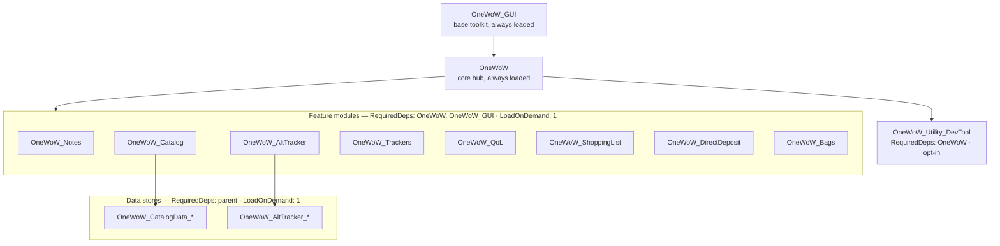

# OneWoW Suite Architecture

Authoritative reference for how the suite is partitioned, loaded, enabled, and
integrated. Describes **what is implemented today**.

Remaining migration work (GUI absorption, CopyPaste, DevTool LOD, enforcement
ramp) lives in [`MIGRATION.md`](MIGRATION.md).

---

## 1. True-core model

The suite ships as **separate addons** (load units / TOCs) but behaves as one
product. `OneWoW_GUI` is the base UI toolkit (interim separate addon until folded
into core). `OneWoW` is the always-loaded hub. Feature modules and data stores are
`## LoadOnDemand: 1` with `RequiredDeps: OneWoW` (and `OneWoW_GUI` today) — nothing
auto-loads except the foundation and core. The orchestrator force-loads enabled units
at startup and drives initialization in deterministic order (§3).

### Why separate TOCs (not one mega-addon)

Manage Features uses `C_AddOns.DisableAddOn` + `ReloadUI` to **truly unload** heavy
modules and multi-MB data tables. A single literal TOC would parse every file at
login; disabling could only skip runtime work — Lua and data stay resident. **Per-module
TOCs preserve real unload.**

Distribution is one package / one install; **load units stay many**. Separate
CurseForge pages were the tracking burden, not separate folders.



---

## 2. Load-unit tiers and TOC summary

| Tier | Units | Loads | Mechanism |
|---|---|---|---|
| **0 — Foundation** | `OneWoW_GUI` (target: folded into `OneWoW`) | Always | Separate addon today; LibStub `OneWoW_GUI-1.0` |
| **1 — Core hub** | `OneWoW` | Always | `RequiredDeps: OneWoW_GUI`; orchestrator, Manage Features, hub UI, shared engines |
| **2 — Feature modules** | AltTracker, Catalog, Notes, Trackers, QoL, ShoppingList, DirectDeposit, Bags | On demand | `RequiredDeps: OneWoW, OneWoW_GUI` + `LoadOnDemand: 1` |
| **3 — Data stores** | `OneWoW_AltTracker_*`, `OneWoW_CatalogData_*` | On demand, after parent | `RequiredDeps: …, <parent>` + `LoadOnDemand: 1`; listed in `ModuleManifest.stores` |
| **4 — Utility** | `OneWoW_Utility_DevTool` | Opt-in | `RequiredDeps: OneWoW`; excluded from recommended preset |

Verified against current `.toc` files:

| Load unit | RequiredDeps | OptionalDeps | LoadOnDemand |
|---|---|---|---|
| **OneWoW_GUI** | — | — | 0 |
| **OneWoW** | OneWoW_GUI | Auctionator, TradeSkillMaster | — |
| **OneWoW_Notes** | OneWoW, OneWoW_GUI | — | 1 |
| **OneWoW_AltTracker** | OneWoW, OneWoW_GUI | — | 1 |
| **OneWoW_Catalog** | OneWoW, OneWoW_GUI | — | 1 |
| **OneWoW_Trackers** | OneWoW, OneWoW_GUI | TradeSkillMaster, Auctionator | 1 |
| **OneWoW_QoL** | OneWoW, OneWoW_GUI | — | 1 |
| **OneWoW_ShoppingList** | OneWoW, OneWoW_GUI | — | 1 |
| **OneWoW_DirectDeposit** | OneWoW, OneWoW_GUI | — | 1 |
| **OneWoW_Bags** | OneWoW, OneWoW_GUI | TradeSkillMaster, Baganator, Masque | 1 |
| **OneWoW_Utility_DevTool** | OneWoW | !BugGrabber | — |
| **OneWoW_AltTracker_\*** | OneWoW, OneWoW_GUI, OneWoW_AltTracker | — | 1 |
| **OneWoW_CatalogData_\*** | OneWoW, OneWoW_GUI, OneWoW_Catalog | — | 1 |

### OptionalDeps policy

**Do not use `## OptionalDeps` for suite-internal features.** Blizzard auto-loads
enabled OptionalDeps when the consumer is `LoadAddOn`'d — bypassing soft opt-out
and the login orchestrator. Suite integrations use nil-guards at call sites and,
for explicit user actions, `OneWoW:WithAddon` / `EnsureLoaded` (§3.8).

External third-party addons (TSM, Auctionator, Baganator, Masque, `!BugGrabber`)
remain valid OptionalDeps.

---

## 3. Load lifecycle

Core owns *when* a unit loads, *when* it initializes, and lifecycle event dispatch.

### 3.1 Why core-driven loading (retired `LoadWith`)

`LoadWith` auto-loads a dependency inside the parent's load. When
`C_AddOns.LoadAddOn` runs inside another addon's `ADDON_LOADED`, WoW does **not**
deliver the loaded module's own `ADDON_LOADED` — its DB setup never ran. Stores are
listed under each parent in `ModuleManifest.stores`; the orchestrator `EnsureLoaded`s
each explicitly after the parent, driving `OnAddonLoaded` deterministically.

Precedent: DBM loads mods with `LoadAddOn` then runs core-driven post-load init —
same pattern as our `OnAddonLoaded` hook.

### 3.2 Orchestrator + manifest

`OneWoW/Core/AddonLoader.lua` holds `OneWoW.ModuleManifest` (every suite unit,
slash command, hub `module` name, `loadPhase`, parent `stores`). At the **end of
core's `ADDON_LOADED`** (before `PLAYER_LOGIN`),
`OneWoW.LoadOrchestrator:RunStartupPhase()` walks the manifest and calls
`OneWoW:BringUp(addon)` for each `loadPhase == "login"` entry (feature + stores as
one set). DevTool is detect-only — skipped by the orchestrator but included in
login fan-out when loaded.

Hub row-1 tab order is derived from manifest hub entries (Notes → AltTracker →
Catalog → Trackers → QoL) via `GetModuleTabOrder` / `GetAlwaysShowModules`.

### 3.3 Event ownership

Only **`OneWoW.lua`** registers `ADDON_LOADED`, `PLAYER_LOGIN`, and
`PLAYER_ENTERING_WORLD` for suite lifecycle dispatch. **`OneWoW_GUI`** still
registers its own `ADDON_LOADED` for self-bootstrap until GUI is absorbed into core
(see `MIGRATION.md` step 6). Embedded `Libs/` are unchanged.

| Registrar | Allowed? |
|-----------|----------|
| `OneWoW.lua` | Yes — sole lifecycle authority for manifest units |
| `OneWoW_GUI` | Yes (interim) — self-bootstrap until absorption |
| Embedded `Libs/` | Yes — third-party, off-limits |
| Feature modules, stores, DevTool, sub-modules | **No** — chain up to manifest parent |

### 3.4 `OnAddonLoaded`

`hooksecurefunc(C_AddOns, "LoadAddOn", …)` calls `RunPostLoadInit` →
`_G[name]:OnAddonLoaded()` for every load path. The hook drives **`OnAddonLoaded`
only** — `OnPlayerLogin` / `OnPlayerEnteringWorld` are driven by `Settle` / `BringUp`
(§3.5–3.6). LOD units force-loaded during core's `ADDON_LOADED` never receive their
own WoW `ADDON_LOADED`.

Data stores use `OneWoW:BootStore(ns, config)` (`Core/StoreBootstrap.lua`).

### 3.5 `OnPlayerLogin`

At core `PLAYER_LOGIN`: `OneWoW:RunManifestLoginPhase()` walks the manifest and calls
`OnAddonLoaded()` (safety net) then `OnPlayerLogin()` on each loaded unit.

Mid-session loads use `OneWoW:BringUp(addon)`: loads `{ addon, ...stores }`, then one
`Settle` pass (`OnPlayerLogin` over the set) so a parent's login runs only after its
stores are loaded — matching cold start.

### 3.6 `OnPlayerEnteringWorld`

On every `PLAYER_ENTERING_WORLD`, `OneWoW:DispatchEnteringWorld(isLogin, isReload)`
computes `isZoning = not isLogin and not isReload` and fans out to all loaded
manifest units.

Mid-session loads missed the real event; `BringUp` (and the lone-load path in the
`LoadAddOn` hook) delivers synthetic catch-up `OnPlayerEnteringWorld(true, false,
false)`: `isLogin=true` mirrors cold start; `isZoning=false` avoids spurious zone
refresh. No synthetic PEW at cold start/reload.

### 3.7 Chain-up pattern

Manifest roots call `OneWoW.Lifecycle:CreateHandlerRegistry(self)` in
`OnAddonLoaded`. Sub-modules register with the parent — never with WoW events:

```lua
parent:RegisterLoginHandler("feature", fn)
parent:RegisterEnteringWorldHandler("feature", function(isLogin, isReload, isZoning)
    if isZoning then ... end
end)
parent:RegisterAddonLoadedWatcher("Blizzard_Foo", fn)
```

| I need to… | Do this | Do NOT |
|------------|---------|--------|
| Init my module DB | `OnAddonLoaded()` on manifest root | `RegisterEvent("ADDON_LOADED")` |
| Arm at login | `OnPlayerLogin()` or `RegisterLoginHandler` | `RegisterEvent("PLAYER_LOGIN")` |
| React to zone change | `OnPlayerEnteringWorld` with `if isZoning` | `RegisterEvent("PLAYER_ENTERING_WORLD")` |
| Hook Blizzard_Foo when it loads | `RegisterAddonLoadedWatcher("Blizzard_Foo", fn)` | Own `ADDON_LOADED` frame |

### 3.8 Loader API

```lua
OneWoW:EnsureLoaded(name [, opts])              -> ok, reason?
OneWoW:WithAddon(name, onReady, onFail, opts)   -> ok
OneWoW:BringUp(addonName)                        -- load feature + stores, then Settle (+ mid-session PEW catch-up)
OneWoW:GetLoadFailureText(reason)               -> localized string
```

- **Soft opt-out enforced:** returns `"OPTED_OUT"` when unit or parent store's parent
  is opted out. Explicit user loads (Blizzard "Load Addon", Manage Features per-row
  button) clear opt-out via the post-hook.
- **`{ deferInCombat = true }`** queues to `PLAYER_REGEN_ENABLED`.
- **Lazy cross-module data:** reserve `WithAddon` for *explicit user actions* (e.g.
  Catalog AH scan → `OneWoW_AltTracker_Auctions`), not speculative tab opens.
- **Trackers → Notes migration** uses `WithAddon("OneWoW_Notes", …)` when Notes is
  wanted but not loaded; defers when Notes is soft-opted-out.

### 3.9 Load phases

| Phase | When loaded | Use for |
|---|---|---|
| `login` | End of core `ADDON_LOADED` if wanted | Passive hooks: tooltips, overlays, toasts, automations |
| `lazy` | First hub tab / window open | Pure-window modules with no passive behavior |

All manifest entries are `login` today. `lazy` defers until `EnsureModuleForTab` in
`MainWindow` (dormant while everything is `login`).

---

## 4. Enable model

Two layers:

1. **Blizzard per-addon enable** (`C_AddOns.{Enable,Disable}AddOn`) — hard layer.
   Disabling truly unloads after reload. Re-enabling a login-disabled unit needs
   reload (`LoadAddOn` returns `DISABLED` mid-session).

2. **Soft opt-out** (`OneWoW_DB.featureOptOut`) — unit stays Blizzard-enabled;
   orchestrator skips loading. Can `LoadAddOn` later same session with no reload.

| Action | Mechanism | Reload? |
|---|---|---|
| Soft disable (Apply) | set `featureOptOut`; orchestrator skips next load | No (loaded unit stays until reload) |
| Soft enable | clear opt-out + `EnsureLoaded` / Load Addon | No |
| Hard disable (Apply & Reload) | `DisableAddOn` + clear opt-out + `ReloadUI` | Yes |
| Hard re-enable | `EnableAddOn` + `ReloadUI` | Yes |
| Load at login | orchestrator `BringUp` during core `ADDON_LOADED` | n/a |

Scope: Manage Features selects account vs current character for both layers. Home is
**read-only** — links to Manage Features for writes.

### 4.1 Enable-state API

```lua
OneWoW:IsAddonEnabled(name, perCharacter)
OneWoW:SetAddonEnabled(name, enabled, perCharacter)
OneWoW:IsFeatureWanted(name, perCharacter)         -- Blizzard-enabled AND not opted out
OneWoW:GetFeatureWantedAggregate(name)             -> "all"|"some"|"none"
OneWoW:GetFeatureUnitState(name)                   -> state string
OneWoW:GetAddonStatus(name, perCharacter)
OneWoW:IsFeatureOptedOut(name)
OneWoW:SetFeatureOptOut(name, optedOut, perCharacter)
```

**`GetFeatureUnitState` return values:**

| State | Meaning |
|---|---|
| `missing` | Addon not installed |
| `disabled` | Blizzard-disabled for current character |
| `not_loaded` | Wanted but not in memory (or soft-disabled, not loaded) |
| `pending_disable` | Soft-disabled but still loaded this session; drops next reload |
| `all` | Loaded; wanted on every known character |
| `some` | Loaded; mixed enable/opt-out across characters |

**`GetAddonStatus`** treats `IsAddOnLoaded` / `DEMAND_LOADED` as healthy — LoD units
force-loaded by the orchestrator report `loadable=false, reason="DEMAND_LOADED"` even
while working.

Manage Features' `FirstRun.CATALOG[].datastores` (consumer graph) and
`ModuleManifest.stores` (ownership graph) remain **distinct** sources of truth.

### 4.2 Home tab live refresh

`GUI/t-home.lua` builds module rows once; each row's `ApplyState()` re-reads
`GetFeatureUnitState`. `MainWindow` registers `EventRegistry` on
`OneWoW.FeatureStateChanged` (fired from `SetFeatureOptOut` and post-`LoadAddOn` hook)
to call `GUI:RefreshHomeStatus()` while Home is visible.

Visual mapping: green = fully wanted; grey = mixed across chars; amber check =
not loaded or `pending_disable` (tag `(off next reload)` for the latter); red X =
Blizzard-disabled.

---

## 5. Hub UI

### 5.1 ModuleRegistry

Modules that appear as row-1 tabs register via `OneWoW:RegisterModule()`:

```lua
_G.OneWoW:RegisterModule({
    name = "catalog",
    displayName = function() return ns.L["ADDON_TITLE_SHORT"] end,
    addonName = "OneWoW_Catalog",
    order = OneWoW:GetModuleTabOrder("catalog"),
    tabs = { ... },
})
```

`ModuleRegistry` stores `name`, `displayName`, `tabs`, `order`. `MainWindow.lua`
calls `tabInfo.create(frame)` lazily; content cached in `moduleContentFrames`.

**Placeholder tabs:** when a hub module is not loaded, `GetAlwaysShowModules()` still
shows its tab (same order, locale key label). Selecting a placeholder prompts load or
Manage Features.

Standalone-window modules (Bags, ShoppingList, DirectDeposit) open via slash commands,
not hub tabs.

### 5.2 Pin pattern

A sub-addon may register both a hub tab and a standalone window. The **Pin** pattern
in `ModuleRegistry` promotes a hub item to a small standalone window — user-controlled,
shared theme/GUI primitives.

---

## 6. Cross-unit sharing

Modules cannot share core's private `ns`. Sharing uses globals:

- **Within a load unit:** `local _, ns = ...`
- **Across load units:** `_G.OneWoW`, `LibStub("OneWoW_GUI-1.0")` (interim), per-unit
  APIs (`OneWoW_Catalog_TradeskillAPI`, `OneWoW_Trackers_API`), store `_API` /
  `_DB` globals.

LibStub is retained for `OneWoW_GUI` and vendored Ace libs today. Target: fold GUI
into core as plain `OneWoW_GUI` global (`MIGRATION.md` step 6).

### Cross-addon references

| From | To | Mechanism | Purpose |
|---|---|---|---|
| OneWoW | OneWoW_Bags | `Integrations/OneWoW_Bags.lua` | Overlay engine with Bags callbacks |
| OneWoW_ShoppingList | OneWoW_Catalog | `OneWoW_Catalog_TradeskillAPI` | Recipe callback |
| OneWoW_Trackers | OneWoW_Notes | `OneWoW_Trackers_API` | Tracker sub-tab in Notes |
| OneWoW_Trackers | OneWoW_Notes_DB | One-time migration | Legacy tracker data drain |

### Store access rules

Every cross-module store read is nil-guarded. Prefer `_API` over `_DB`. Core reads
stores opportunistically (tooltips, overlays) — never as a load trigger.

---

## 7. Taxonomy

| Kind | Definition | Examples |
|---|---|---|
| **Sub-addon** | Separate TOC / load unit | `OneWoW_Catalog`, `OneWoW_AltTracker_Storage` |
| **Feature** | User-facing capability in a sub-addon | Journal tab, AH scanner, bag bar |
| **Provider** | Registered data source with lifecycle/SV | Future `DataManager` providers |
| **Service** | Near-stateless utility on `_G.OneWoW` | `OverlayEngine`, `CopyPaste` (target) |

**Hub vs contextual:** hub = tabs in OneWoW window; contextual = own window in
gameplay context (Bags, ShoppingList, DirectDeposit, DevTool). Not binary — modules
may register both.

### Layering rules

1. **No sub-addon reads another family's store global directly.** Lint:
   `bin/check_no_data_manager_bypass.py` (phased enforcement — see `MIGRATION.md`).
2. **Inverse dependencies via events/callbacks**, not direct calls — core stays
   consumer-agnostic.
3. **Cross-unit data** should route through `DataManager:Query` (planned broker in
   core — not yet implemented). Consumers ask; providers register; empty when absent.

**Promotion discipline:** second consumer → promote to core. Provider → `Providers/`;
stateless utility → `Services/` on `_G.OneWoW`. Rule of Three before abstracting.

---

## 8. GUI and settings integration

### 8.1 OneWoW_GUI

All addons use `LibStub("OneWoW_GUI-1.0")` for shared UI and theme. Theme is single
source of truth in `OneWoW_GUI_DB`.

```lua
local OneWoW_GUI = LibStub("OneWoW_GUI-1.0", true)
if not OneWoW_GUI then return end
```

Fail fast — no defensive nil-chain guards on methods.

**Component API:** `(parent, options)`. See `OneWoW_GUI/GUI.md` and the
`onewow-gui-ui` skill for policy.

**Database API:** `OneWoW_GUI.DB` — see `onewow-database-api` skill.

### 8.2 Settings change broadcast

`OneWoW_GUI:SetSetting(key, value)` writes and fires callbacks:

| Key | Side effect | Event(s) |
|---|---|---|
| `theme` | `ApplyTheme()` | `OnThemeChanged` |
| `font` | — | `OnFontChanged` |
| `fontSizeOffset` | — | `OnFontSizeChanged` + `OnFontChanged` |

Hub runs `GUI:FullReset()` on theme change.

### 8.3 Profile apply

`GUI/t-profiles.lua` reapplies theme and language via `SyncSettingToChildAddons` —
iterates integrated addons and calls `ApplyTheme()` / `ApplyLanguage()` where present,
then `GUI:FullReset()`. Font/size not part of profile sync.

### 8.4 Font sizing

All font application funnels through `OneWoW_GUI:SafeSetFont(fontString, fontPath,
size, flags)` with `fontSizeOffset` from `OneWoW_GUI_DB` (range −3..+5, floor 6).

---

## 9. Caveats

- **Runtime nil-guards** remain the backstop; lint checks are additive, not compile-time.
- **Stores expose `_DB` and `_API`:** cross-module consumers should prefer `_API`; direct
  `_DB` reads are a refactor target.
- **`DEMAND_LOADED` is normal** for force-loaded LoD units — not an error state.
- **Secret values (12.0+):** combat-related data may be opaque in instances; use Blizzard
  templates for combat UI rather than branching on secret values from tainted code.
- **Mid-session hard enable** always needs reload; soft layer exists specifically to avoid
  that for reload-free toggles.

---

## 10. File reference

| File | Purpose |
|---|---|
| `OneWoW/Core/AddonLoader.lua` | Manifest, orchestrator, `BringUp`/`EnsureLoaded`, enable API, tab-order helpers |
| `OneWoW/Core/Lifecycle.lua` | Lifecycle dispatch, handler registries, addon-loaded watchers |
| `OneWoW/Core/StoreBootstrap.lua` | `OneWoW:BootStore` for data stores |
| `OneWoW/Core/ModuleRegistry.lua` | Hub tab/module registration |
| `OneWoW/Core/FirstRunWizard.lua` | First-run picker + Manage Features (read/write enable state) |
| `OneWoW/GUI/t-home.lua` | Home tab: read-only status + live refresh |
| `OneWoW/GUI/MainWindow.lua` | Hub window; module tabs, placeholders, `FeatureStateChanged` |
| `OneWoW/Docs/MIGRATION.md` | Remaining migration checklist (steps 5–8) |
