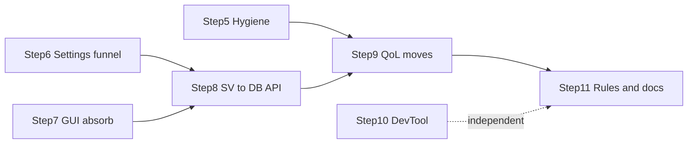

# OneWoW Suite — Remaining migration

Active checklist for work not yet complete. **Implemented architecture** lives in
[`ARCHITECTURE.md`](ARCHITECTURE.md) — read that first.

Delete this file when all steps below are done and their target-state details are
folded into `ARCHITECTURE.md`.

---

## Target state: core services vs. movable content

After migration, `OneWoW` is a **thin core**: lifecycle orchestrator, hub UI,
shared engines/services, and integrations. Feature *content* that today lives in
core moves to `OneWoW_QoL` (avoids new CurseForgepackaging). Settings keys stay
in `OneWoW_DB` (accessed via `SettingsFeatureRegistry`) so a future second move
to dedicated load units needs no SavedVariables migration.

### Core services (stay resident — always loaded)

| Service | Location | External consumers |
|---|---|---|
| **TooltipEngine** | `Tooltips/tooltip-engine.lua` | Bags, QoL, DirectDeposit (`RegisterProvider`) |
| **OverlayEngine** | `Features/overlay-engine.lua` | Bags; external bag-addon integrations in `Integrations/*.lua` |
| **Toast engine** | `Features/toast-engine.lua` (~600 lines) | Promote to `OneWoW.Toast`; toast *types* move to QoL (step 9a) |
| **ItemStatus** | `Features/itemstatus.lua` | Bags (`ItemButton.lua`, `Data/Categories.lua`) |
| **UpgradeDetection** | `Features/upgrade-detection.lua` | Bags (`ItemButton.lua`, `Data/Categories.lua`) |
| **RecipeKnownUtil** | `Core/RecipeKnownUtil.lua` | Trackers, QoL, CatalogData_Journal, GUI PredicateEngine |
| **ItemPrices** | `Core/ItemPrices.lua` + `OneWoW_ItemPricesAPI` | Tooltip providers, other units |
| **SettingsFeatureRegistry** | `Core/SettingsFeatureRegistry.lua` | All feature settings reads/writes (step 6) |

Also stays in core: hub UI (`GUI/`), Search, Minimap, lifecycle/orchestrator
(`Core/AddonLoader.lua`, `Core/Lifecycle.lua`, …), `ContextMenus`, bag-addon
integration shims, `ExternalTooltipSync`.

### Movable feature content (→ `OneWoW_QoL`, step 9)

| Area | Files to move |
|---|---|
| **Toast types** | `Features/toast-loot.lua`, `toast-notes.lua`, `toast-instance.lua`, `toastalerts.lua`, `GUI/t-toastalerts.lua` |
| **Tooltip providers** | All 14 `Tooltips/tp-*.lua`, `Tooltips/tooltips.lua` (provider bootstrap), `GUI/t-tooltips.lua` |
| **Portal Hub** | All of `Portals/` (data + modules), `GUI/t-portals.lua` |
| **Overlays settings** | `GUI/t-overlays.lua` minimum; audit `Features/overlays.lua`, `overlay-icons.lua` for type logic vs. engine (step 9d) |

### Step ordering



Steps **5**, **6**, and **10** have no dependencies — can ship in any order.
Steps **7 → 8 → 9** must stay in sequence.

---

## 5. Core lifecycle hygiene

De-risks everything after. Ship early; no dependency on other steps.

- [x] Gate `DispatchUnitOnAddonLoaded` / `RunPostLoadInit` to **manifest units
  only** — stop calling `OnAddonLoaded` on arbitrary `_G[name]` tables when
  Blizzard or third-party addons load (`Core/Lifecycle.lua`,
  `Core/AddonLoader.lua`).
- [x] Scope opt-out clearing in the `LoadAddOn` post-hook
  (`Core/AddonLoader.lua` ~506): only clear `featureOptOut` for explicit user
  loads (Blizzard "Load Addon", Manage Features), not every programmatic
  `LoadAddOn` from other addons.
- [x] Dedupe `RunUnitHook` (currently defined in both `Core/AddonLoader.lua` and
  `Core/Lifecycle.lua`).
- [x] Route tooltip `ProcessProviders` pcall failures through
  `Lifecycle.SafeCall` / `geterrorhandler()` (`Tooltips/tooltip-engine.lua` ~257)
  instead of silent swallow.
- [x] Delete dead 10.0.2 tooltip fallback: `OnTooltipSetUnit` /
  `OnTooltipSetItem` branch (`tooltip-engine.lua` ~100–118, ~338–390) and the
  `Initialize` retry timer — `TooltipDataProcessor` is always present on Retail
  12+.
- [x] Convert core's `PLAYER_LOGIN` if-chain (`OneWoW.lua` ~169–195) to
  `RegisterCoreLoginHandler` registrations — prerequisite for moving feature
  `Initialize()` calls to QoL in step 9.

---

## 6. Settings access funnel

Prep for steps 8–9. No dependency on step 7.

- [x] Route feature reads/writes of `OneWoW.db.global.settings.*` through
  `SettingsFeatureRegistry` (`Core/SettingsFeatureRegistry.lua`); extended with
  `GetSetting`/`SetSetting`, `GetFeatureSettings` (read-only live block),
  `IsIntegrationEnabled`/`SetIntegrationEnabled`, `ResetTab`, and
  `RegisterListener` pub/sub. Storage mechanics delegate to `OneWoW_GUI.DB`
  primitives. Mutations notify listeners; `OverlayEngine` (coalesced
  `RequestRefresh`) and `ExternalTooltipSync` subscribe instead of being called
  by GUI code.
- [x] Replace direct `OneWoW.db and OneWoW.db.global and ...` guards in feature
  code with registry calls (kills ~60 defensive nil-chains; insulates from SV
  migration and QoL move).
- [x] Primary touch surfaces: `GUI/t-tooltips.lua`, `GUI/t-overlays.lua`,
  `Features/*`, `Tooltips/tp-*`, `Tooltips/tooltip-engine.lua`,
  `Core/ItemPrices.lua`, the 6 bag-integration shims.
- [x] Discovered additions: `OneWoW_Trackers/UI/ui-tracker-farmvalue.lua` was a
  direct settings writer via an aliased `ow.db.global.settings` reference
  (`MutateOneWoWValue`) — migrated to `SetSetting`; `ExternalTooltipSync`
  runtime state (`_auctionatorTooltipBackup`, popup flags) relocated out of
  `settings.tooltips.value` into `db.global.externalTooltipSync` via a
  versioned `DB:RunMigrations` step; `bagnon`/`elvui` integration defaults
  completed.
- [x] Enforcement: `no-settings-bypass` pre-commit hook
  (`bin/check_no_settings_bypass.py`) forbids the `db.global.settings` suffix
  pattern outside `SettingsFeatureRegistry.lua`/`Database.lua`.
- Out of scope (separate DB roots, follow-up before step 9): `portalHub`,
  `toasts` — `GUI/t-portals.lua`, `GUI/t-toastalerts.lua`, `Portals/*`.

---

## 7. Absorb `OneWoW_GUI` into core + de-LibStub

Move GUI files into the `OneWoW` load unit (listed **first** in core TOC).
Publish `OneWoW_GUI` as a plain global instead of a LibStub library.

### Entry point change

```lua
-- before (OneWoW_GUI addon)
LibStub:NewLibrary("OneWoW_GUI-1.0", N)

-- after (inside OneWoW core TOC)
OneWoW_GUI = OneWoW_GUI or {}
```

Keep the global name **`OneWoW_GUI`** (not `OneWoW.GUI`) — consumer migration is a
handle swap only:

```lua
-- before
local OneWoW_GUI = LibStub("OneWoW_GUI-1.0", true)
if not OneWoW_GUI then return end

-- after
local OneWoW_GUI = OneWoW_GUI
```

No defensive `if not OneWoW_GUI` guard once everything `RequiredDeps: OneWoW`.

### Same-commit requirements

- [ ] Add `"OneWoW_GUI"` to `.luarc.json` `diagnostics.globals`.
- [ ] Drop `RequiredDeps: OneWoW_GUI` from every other unit (they keep
  `RequiredDeps: OneWoW`).
- [ ] **Keep LibStub** for vendored Ace libs (`LibDataBroker-1.1`, `LibDBIcon-1.0`,
  `CallbackHandler-1.0`).
- [ ] Rewire `OneWoW_GUI/Settings.lua` `ADDON_LOADED("OneWoW_GUI")` bootstrap to
  core lifecycle (`OneWoW:OnAddonLoaded`) — retire the interim exception in
  `ARCHITECTURE.md` §3.3.
- [ ] Move `OneWoW_GUI_DB` into `OneWoW.toc` `## SavedVariables` (global name
  unchanged — no user migration).
- [ ] Audit `Interface\AddOns\OneWoW_GUI\` media paths (`Constants.lua`,
  `OneWoW.toc` `IconTexture`, `Media/fonts.lua`, QoL references); relocate or
  keep folder on disk.
- [ ] Note: GUI `PredicateEngine` → `RecipeKnownUtil` upward dependency dissolves
  once GUI and core share one load unit.

### Target TOC shape (post-step-7)

| Load unit | Key directives |
|---|---|
| `OneWoW` | *(no `RequiredDeps`)* · contains GUI + `OneWoW.CopyPaste` + Ace libs · `OptionalDeps: Auctionator, TradeSkillMaster` |
| Feature modules | `RequiredDeps: OneWoW` · `LoadOnDemand: 1` |
| Data stores | `RequiredDeps: OneWoW, OneWoW_<Parent>` · `LoadOnDemand: 1` |

(`OneWoW_GUI` is no longer a separate load unit.)

### 7.1 Relocate `LibCopyPaste` → `OneWoW.CopyPaste`

Ship immediately after step 7 (same PR or follow-up).

- [ ] Move into the `OneWoW` core addon (after GUI files in TOC — `CopyPaste` may
  use GUI helpers after restyle).
- [ ] Drop LibStub + version: `OneWoW.CopyPaste = {}`. Method API (`:Copy`,
  `:Paste`) unchanged.
- [ ] Repoint consumers (`OneWoW_Bags` ×3, `OneWoW_Utility_DevTool`, QoL
  copytext/coords).
- [ ] **Follow-up:** restyle UI with `OneWoW_GUI` helpers and localized strings
  (replace hardcoded backdrop/colors and literal `"Close"`).

---

## 8. OneWoW SV → `OneWoW_GUI.DB` API

**Requires step 7.** **Must precede step 9** (churn settings paths while files
still live in core).

OneWoW and AltTracker are the last two load units not fully on the DB API.

### OneWoW (this step)

- [ ] Convert `Core/Database.lua` from hand-rolled `InitializeDatabase` +
  `DB:MergeMissing` to `DB:Init` with a proper defaults table.
- [ ] Fold ad-hoc migrations into `DB:RunMigrations`:
  - Overlay position renames (`TOPLEFT_OUTER` → `Outer-Top-Left`, etc.)
  - `resetToDefaultsV1` toast reset block
  - LSM font name migration (`MigrateLSMFontName`)
- [ ] Consolidate theme default: single source in `OneWoW_GUI_DB` (remove duplicate
  `theme = "green"` in `OneWoW_DB` defaults once `ApplyTheme` precedence is
  clear).

### AltTracker (independent — any time)

- [ ] Migrate `OneWoW_AltTracker` inline `InitializeDatabase` (~80 lines in
  `OneWoW_AltTracker.lua`) to `DB:Init` pattern used by other hub modules.
- [ ] No ordering constraint relative to steps 5–9.

---

## 9. Feature moves to `OneWoW_QoL`

**Requires step 8** (settings paths stable). Each sub-step is independently
shippable unless noted.

### Shared rules (every sub-step)

1. **Settings keys stay in `OneWoW_DB`** — accessed only via
   `SettingsFeatureRegistry` (no SV migration; survives a future second move to
   dedicated load units).
2. **Locale strings stay in core `OneWoW.L`** for now (QoL feature code reads
   `OneWoW.L[...]` cross-unit; avoids locale churn on a potential second move).
3. **Settings tab** leaves `qolFeatureTabs` in `GUI/t-settings.lua` and registers
   natively in QoL's `RegisterModule` row-2 tabs (`OneWoW_QoL.lua`).
4. **Lifecycle:** feature `Initialize()` moves from core `RegisterCoreLoginHandler`
   (step 5) to QoL `OnPlayerLogin` / `RegisterLoginHandler`.
5. **TOC:** remove moved files from `OneWoW.toc`; add to `OneWoW_QoL.toc` in
   sensible load order (after QoL core, before or with other external modules).

### 9a. Toast types (pilot)

Validates the move pattern end-to-end. Zero external consumers today.

**Move:**
- `Features/toast-loot.lua`, `toast-notes.lua`, `toast-instance.lua`
- `Features/toastalerts.lua`
- `GUI/t-toastalerts.lua`

**Stay in core:**
- `Features/toast-engine.lua` — promote to `OneWoW.Toast` service (anchor,
  queue, render).

- [ ] Move files; wire QoL lifecycle init for toast types.
- [ ] Register `toastalerts` settings tab in QoL `RegisterModule` tabs.
- [ ] Remove `toastalerts` from `qolFeatureTabs`.

### 9b. Tooltip providers

**Move:**
- All 14 `Tooltips/tp-*.lua` files (see `OneWoW.toc` lines 71–83)
- `Tooltips/tooltips.lua` (provider registration bootstrap)
- `GUI/t-tooltips.lua`

**Stay in core:**
- `Tooltips/tooltip-engine.lua` — `TooltipEngine:RegisterProvider` API unchanged;
  Bags, QoL, DirectDeposit already register from their own load units.

- [ ] Move files; providers call `OneWoW.TooltipEngine:RegisterProvider` on QoL
  login (same pattern as `OneWoW_Bags/Integrations/OneWoWTooltips.lua`).
- [ ] Register `tooltips` settings tab in QoL.
- [ ] Remove `tooltips` from `qolFeatureTabs`.

### 9c. Portal Hub

Consolidates existing QoL coupling (`OneWoW_QoL/Modules/external/escpanel.lua`,
`framemover-core.lua` already read/write `OneWoW.db.global.portalHub` and call
`OneWoW.PortalHubEsc`).

**Move:**
- `Portals/Data/*.lua`, all `Portals/portalhub*.lua`
- `GUI/t-portals.lua`

**Stay in core:**
- Nothing portal-specific in core services roster (Portal Hub is feature content).

**Audit before move:**
- `Portals/portalhub-esc.lua` ~631: `ModuleRegistry:IsRegistered("qol")` branch —
  may simplify once portals live in QoL.
- Core `Bindings.xml` has hub bindings only (toggle, reload, junk/protected) — no
  portal-specific bindings to move.
- `portalHub` settings block in `Core/Database.lua` defaults stays in `OneWoW_DB`.

- [ ] Move files; wire QoL lifecycle for `PortalHubModule` / `PortalHubEsc`
  init (currently early-phase `RegisterCoreLoginHandler` registrations in the
  portal files).
- [ ] Register `portals` settings tab in QoL.
- [ ] Remove `portals` from `qolFeatureTabs`.

### 9d. Overlays settings (audit-first)

**Minimum move:**
- `GUI/t-overlays.lua`

**Audit before move** (overlay type detection may be engine-embedded):
- `Features/overlay-engine.lua` — service; stays.
- `Features/overlays.lua`, `Features/overlay-icons.lua` — decide per-type: engine
  hook vs. movable content.
- `Features/upgrade-detection.lua`, `Features/itemstatus.lua` — **stay** (core
  services; Bags depends on them).

- [ ] Complete audit; move agreed content only.
- [ ] Register `overlays` settings tab in QoL.
- [ ] Remove `overlays` from `qolFeatureTabs`.

### 9 closeout

When `qolFeatureTabs` in `GUI/t-settings.lua` is empty:

- [ ] Delete `qolFeatureTabs` and `GUI:GetQoLFeatureTabs()`.
- [ ] Delete `GetQoLFeatureTabs` consumption in `OneWoW_QoL.lua` (~21–24).
- [ ] Delete `BuildSettingsTabs` fallback (`if not ModuleRegistry:IsRegistered("qol")`
  ~74–77) — removes settings-tab teleporting between QoL and Settings.
- [ ] Fold service roster + "feature content registers from QoL" into
  `ARCHITECTURE.md` §6–7.

---

## 10. DevTool (partial)

No ordering constraint. Can ship any time.

**Done:** `RequiredDeps: OneWoW` (no longer `OneWoW_GUI` only). Lifecycle hooks
from core when loaded.

**Remaining:**

- [ ] Fold into the suite package branding (single distributable).
- [ ] Tag `utility` in Manage Features so the recommended preset keeps it off.
- [ ] Retire standalone CurseForge page.
- [ ] **Decide:** convert to `LoadOnDemand: 1` like feature modules (orchestrator
  skip, explicit enable) vs. stay auto-load when Blizzard-enabled.

**Current TOC:**

```
## RequiredDeps: OneWoW
## OptionalDeps: !BugGrabber
```

---

## 11. Update rules + skills + enforcement

**Requires step 7** for LibStub rule revisions. **After step 9** for service
roster documentation.

### Done

- [x] `bin/check_suite_lifecycle.py` + pre-commit hook `no-suite-lifecycle-events`
- [x] `bin/check_toc_optional_deps.py` + pre-commit hook `no-suite-internal-optionaldeps`
- [x] `.cursor/rules/OneWoW-Suite-Architecture.mdc`
- [x] `.cursor/skills/onewow-suite-architecture/SKILL.md`
- [x] `WoW-Lua-Addon-Development.mdc` suite override blurb (§4.2) + specialist skill entry

### Remaining (after step 7)

- [ ] Revise `.cursor/rules/WoW-Lua-Addon-Development.mdc` §2.3 and the
  `onewow-gui-ui` / `onewow-database-api` skills: `local OneWoW_GUI = OneWoW_GUI`
  instead of the LibStub block.

### Remaining (after step 9)

- [ ] Document core service roster in `ARCHITECTURE.md` §6–7: engines and shared
  detection (`ItemStatus`, `UpgradeDetection`, `RecipeKnownUtil`, `ItemPrices`)
  are core services; feature content registers in from QoL.
- [ ] Audit for other `ModuleRegistry:IsRegistered(...)`-conditional UI placement
  (known: `GUI/t-settings.lua`, `Portals/portalhub-esc.lua`, `GUI/MainWindow.lua`
  placeholder tabs).

### `DataManager` enforcement ramp

`bin/check_no_data_manager_bypass.py` (hook `no-data-manager-bypass`) phases direct
cross-family store reads toward `DataManager:Query` (see `ARCHITECTURE.md` §7).

| Phase | Lint behavior | Allowlist | Exit code |
|---|---|---|---|
| **1 — now** | warn-only on cross-family reads | all grandfathered reads listed | `0` |
| **2 — migrating** | warn on allowlisted; **fail** on new off-list reads | shrinks per migration PR | `1` for off-list only |
| **3 — rule** | hard-fail on every cross-family read | empty (removed) | `1` |

- [ ] Phase 2: populate `ALLOWLIST` from warn output, set `WARN_ONLY = False`
- [ ] Phase 3: empty allowlist, hard-fail all cross-family reads

Each migration PR deletes allowlist `path::symbol` keys. When the allowlist is
empty, flip to Phase 3.
