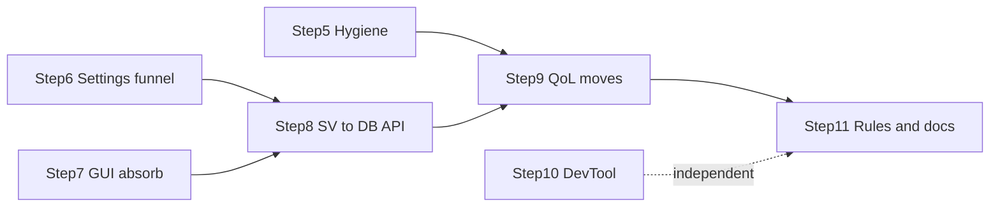

# OneWoW Suite — Remaining migration

Active checklist for work not yet complete. **Implemented architecture** lives in
[`ARCHITECTURE.md`](ARCHITECTURE.md) — read that first.

Delete this file when all steps below are done and their target-state details are
folded into `ARCHITECTURE.md`.

> **Note (migration cleanup, not a checklist step):** Completed `RunMigrations`
> collapse for **OneWoW** (core v1–v5), **OneWoW_QoL** (4), **OneWoW_Notes**
> (6), **OneWoW_Trackers** (5 + deleted `TrackerMigration.lua`), and
> **OneWoW_Bags** (18). Also **Catalog** + **CatalogData** ×4 (1–3 steps each)
> and **DirectDeposit** (4).
> Idempotent SV shape bridges kept where noted in code
> (flat→`.global`, `BridgeLegacyDatabase`, Notes char-key consolidate,
> Trackers Notes/CharDB drain). Assumes users have logged in on a recent build.
> **7.2**, DevTool, AltTracker — still open below.

---

## Target state: core services vs. movable content

After migration, `OneWoW` is a **thin core**: lifecycle orchestrator, hub UI,
shared engines/services, and integrations. Feature *content* that today lives in
core moves to `OneWoW_QoL` (avoids new CurseForgepackaging). Settings keys stay
in `OneWoW_DB` (accessed via `SettingsFeatureRegistry`) so a future second move
to dedicated load units needs no SavedVariables migration.

### Core services (stay resident — always loaded)

| Service | Location | External consumers |
|---|---|---|
| **TooltipEngine** | `Services/tooltip-engine.lua` | Bags, QoL, DirectDeposit (`RegisterProvider`) |
| **OverlayEngine** | `Services/overlay-engine.lua` | Bags; external bag-addon integrations in `Integrations/*.lua` |
| **Toast engine** | `Services/toast-engine.lua` (`OneWoW.Toasts`) | OneWoW_Notes (`FireZoneAlert`, `FireItemLootAlert`); toast *types* moved to QoL (step 9a) |
| **ItemStatus** | `Services/itemstatus.lua` | Bags (`ItemButton.lua`, `Data/Categories.lua`) |
| **UpgradeDetection** | `Services/upgrade-detection.lua` | Bags (`ItemButton.lua`, `Data/Categories.lua`) |
| **RecipeKnownUtil** | `Services/RecipeKnownUtil.lua` | Trackers, QoL, CatalogData_Journal, PredicateEngine |
| **ItemPrices** | `Services/ItemPrices.lua` + `OneWoW_ItemPricesAPI` | Tooltip providers, other units |
| **SettingsFeatureRegistry** | `Core/SettingsFeatureRegistry.lua` | All feature settings reads/writes (step 6) |

> **Note:** the eight service files above were relocated into a single
> `OneWoW/Services/` TOC block after step 9 (they were previously scattered
> across `Core/`, `Features/`, and `Tooltips/` — the old paths in the completed
> 9a/9b/9d narratives below reflect their location *at the time of that step*).
> `SettingsFeatureRegistry` stayed in `Core/` as the settings funnel. Globals
> (`OneWoW.*`) are unchanged — consumers were not touched.

Also stays in core: hub UI (`UI/`), Search, Minimap, lifecycle/orchestrator
(`Core/AddonLoader.lua`, `Core/Lifecycle.lua`, …), `ContextMenus`, bag-addon
integration shims, `ExternalTooltipSync`.

### Movable feature content (→ `OneWoW_QoL`, step 9)

| Area | Files to move |
|---|---|
| **Toast types** | ~~`Features/toast-loot.lua`, `toast-instance.lua`, `toastalerts.lua`, `UI/t-toastalerts.lua`~~ — **done** (step 9a; `toast-notes.lua` folded into the core engine instead) |
| **Tooltip providers** | ~~All 13 `Tooltips/tp-*.lua`, `Tooltips/tooltips.lua` (settings catalog bootstrap), `UI/t-tooltips.lua`~~ — **done** (step 9b) |
| **Portal Hub** | ~~All of `Portals/` (data + modules), `UI/t-portals.lua`~~ — **done** (step 9c) |
| **Overlays settings** | ~~`Features/overlays.lua` (settings catalog), `UI/t-overlays.lua`~~ — **done** (step 9d; `overlay-icons.lua` stayed as an engine rendering dependency) |

### Step ordering



Steps **5**, **6**, and **10** have no dependencies — can ship in any order.
Steps **7 → 8 → 9** must stay in sequence.

---

## 5. Core lifecycle hygiene

De-risks everything after. Ship early; no dependency on other steps.

- [x] Gate `DispatchUnitOnAddonLoaded` / `RunPostLoadInit` to **manifest units
  only** — stop calling `OnAddonLoaded` on arbitrary `_G[name]` tables when
  Blizzard or third-party addons load (`Core/Lifecycle.lua`,
  `Core/AddonLoader.lua`).
- [x] Scope opt-out clearing in the `LoadAddOn` post-hook
  (`Core/AddonLoader.lua` ~506): only clear `featureOptOut` for explicit user
  loads (Blizzard "Load Addon", Manage Features), not every programmatic
  `LoadAddOn` from other addons.
- [x] Dedupe `RunUnitHook` (currently defined in both `Core/AddonLoader.lua` and
  `Core/Lifecycle.lua`).
- [x] Route tooltip `ProcessProviders` pcall failures through
  `Lifecycle.SafeCall` / `geterrorhandler()` (`Tooltips/tooltip-engine.lua` ~257)
  instead of silent swallow.
- [x] Delete dead 10.0.2 tooltip fallback: `OnTooltipSetUnit` /
  `OnTooltipSetItem` branch (`tooltip-engine.lua` ~100–118, ~338–390) and the
  `Initialize` retry timer — `TooltipDataProcessor` is always present on Retail
  12+.
- [x] Convert core's `PLAYER_LOGIN` if-chain (`OneWoW.lua` ~169–195) to
  `RegisterCoreLoginHandler` registrations — prerequisite for moving feature
  `Initialize()` calls to QoL in step 9.

---

## 6. Settings access funnel

Prep for steps 8–9. No dependency on step 7.

- [x] Route feature reads/writes of `OneWoW.db.global.settings.*` through
  `SettingsFeatureRegistry` (`Core/SettingsFeatureRegistry.lua`); extended with
  `GetSetting`/`SetSetting`, `GetFeatureSettings` (read-only live block),
  `IsIntegrationEnabled`/`SetIntegrationEnabled`, `ResetTab`, and
  `RegisterListener` pub/sub. Storage mechanics delegate to `OneWoW_GUI.DB`
  primitives. Mutations notify listeners; `OverlayEngine` (coalesced
  `RequestRefresh`) and `ExternalTooltipSync` subscribe instead of being called
  by GUI code.
- [x] Replace direct `OneWoW.db and OneWoW.db.global and ...` guards in feature
  code with registry calls (kills ~60 defensive nil-chains; insulates from SV
  migration and QoL move).
- [x] Primary touch surfaces: `UI/t-tooltips.lua`, `UI/t-overlays.lua`,
  `Features/*`, `Tooltips/tp-*`, `Tooltips/tooltip-engine.lua`,
  `Core/ItemPrices.lua`, the 6 bag-integration shims.
- [x] Discovered additions: `OneWoW_Trackers/UI/ui-tracker-farmvalue.lua` was a
  direct settings writer via an aliased `ow.db.global.settings` reference
  (`MutateOneWoWValue`) — migrated to `SetSetting`; `ExternalTooltipSync`
  runtime state (`_auctionatorTooltipBackup`, popup flags) relocated out of
  `settings.tooltips.value` into `db.global.externalTooltipSync` via a
  versioned `DB:RunMigrations` step; `bagnon`/`elvui` integration defaults
  completed.
- [x] Enforcement: `no-settings-bypass` pre-commit hook
  (`bin/check_no_settings_bypass.py`) forbids the `db.global.settings` suffix
  pattern outside `SettingsFeatureRegistry.lua`/`Database.lua`.
- Out of scope (separate DB roots): `portalHub` — kept as its own root by
  explicit decision in step 9c (more user data/state than feature toggles;
  accessed directly via the global `OneWoW.db`). (`toasts` was folded into
  `settings.toastalerts` as part of step 9a — migration v5.)

---

## 7. Absorb `OneWoW_GUI` into core + de-LibStub

Move GUI files into the `OneWoW` load unit (listed **first** in core TOC).
Publish `OneWoW_GUI` as a plain global instead of a LibStub library.

- [x] **Pre-step shipped:** `OneWoW_GUI/Core.lua` utilities extracted to OneWoW
  core services — `OneWoW.Format` (`Core/Format.lua`), `OneWoW.Restriction`
  (`Core/Restriction.lua`), top-level `OneWoW:GetAddonVersion` /
  `OneWoW:GetExpansionName` (`Core/Util.lua`). All callers updated suite-wide
  (no shims). `Core.lua` retains only frame helpers (`SaveWindowPosition`,
  `RestoreWindowPosition`, `ClearFrame`), `GetItemQualityColor`, and `noop`.

### Entry point change

```lua
-- before (OneWoW_GUI addon)
LibStub:NewLibrary("OneWoW_GUI-1.0", N)

-- after (inside OneWoW core TOC)
OneWoW_GUI = OneWoW_GUI or {}
```

Keep the global name **`OneWoW_GUI`** (not `OneWoW.GUI`) — consumer migration is a
handle swap only:

```lua
-- before
local OneWoW_GUI = LibStub("OneWoW_GUI-1.0", true)
if not OneWoW_GUI then return end

-- after
local OneWoW_GUI = OneWoW_GUI
```

No defensive `if not OneWoW_GUI` guard once everything `RequiredDeps: OneWoW`.

### Same-commit requirements

- [x] Add `"OneWoW_GUI"` to `.luarc.json` `diagnostics.globals`.
- [x] Rename hub `OneWoW/GUI/` → `OneWoW/UI/` and the `OneWoW.GUI` namespace →
  `OneWoW.UI` suite-wide; toolkit lands in the vacated `OneWoW/GUI/` so the
  directory matches the global it publishes.
- [x] Drop `RequiredDeps: OneWoW_GUI` from every other unit (they keep
  `RequiredDeps: OneWoW`).
- [x] **Keep LibStub** for vendored Ace libs (`LibStub`, `CallbackHandler-1.0`,
  `LibDataBroker-1.1`, `LibDBIcon-1.0`, `LibSharedMedia-3.0`) — moved into
  `OneWoW/Libs/`, listed before the toolkit in the TOC.
- [x] Rewire `GUI/Settings.lua` bootstrap: `ADDON_LOADED("OneWoW_GUI")` frame
  replaced by `OneWoW_GUI:InitializeSettings()`, called first in
  `OneWoW:OnAddonLoaded` — interim exception in `ARCHITECTURE.md` §3.3 and
  `bin/check_suite_lifecycle.py` retired.
- [x] **SavedVariables handoff:** `OneWoW_GUI_DB` declared in `OneWoW.toc`
  (temporary — folds into `OneWoW_DB` in step 8). The variable name is
  unchanged but the backing file is keyed to the addon folder, so the old
  `OneWoW_GUI` folder remains as a **TOC-only stub** that loads the legacy
  `WTF\...\SavedVariables\OneWoW_GUI.lua` into `_G`. `OneWoW.toc` keeps
  `RequiredDeps: OneWoW_GUI` (transitional) so the stub's SV loads before
  core's `InitializeSettings` reads it. At logout both TOCs persist the
  variable, so core's own SV file carries a full copy after one session.
- [x] Relocate media: `OneWoW_GUI/Media/` merged into `OneWoW/Media/` (all
  overlapping files were byte-identical); every `IconTexture` line,
  `GUI/Constants.lua` `MEDIA_BASE`, `Media/fonts.lua`, and QoL references
  repointed to `Interface\AddOns\OneWoW\Media\`.
- [x] Relocate docs/tools: `Docs/{PREDICATE_ENGINE,DATABASE}.md` →
  `OneWoW/Docs/`, `README.md` → `OneWoW/Docs/GUI.md`,
  `tools/theme_contrast_check.py` → `bin/`.
- [x] Note: GUI `PredicateEngine` → `RecipeKnownUtil` upward dependency dissolves
  once GUI and core share one load unit.

### 7.2 Retire the `OneWoW_GUI` SV-handoff stub

**Requires step 8** (data folded into `OneWoW_DB`), then wait one or two
releases so most users have logged out at least once on the new layout.

- [ ] Delete the `OneWoW_GUI` folder (TOC-only stub).
- [ ] Remove `RequiredDeps: OneWoW_GUI` from `OneWoW.toc` (`OneWoW_GUI_DB`
  already removed from its `SavedVariables` in step 8).
- [ ] Remove the stub rows/notes from `ARCHITECTURE.md` §1–2.
- Users who skip the entire transition window lose theme/profile settings
  (one-time, defaults apply) — accepted tradeoff.

### Target TOC shape (post-step-7.2)

| Load unit | Key directives |
|---|---|
| `OneWoW` | *(no `RequiredDeps`)* · contains GUI + `OneWoW.CopyPaste` + Ace libs · `OptionalDeps: Auctionator, TradeSkillMaster` |
| Feature modules | `RequiredDeps: OneWoW` · `LoadOnDemand: 1` |
| Data stores | `RequiredDeps: OneWoW, OneWoW_<Parent>` · `LoadOnDemand: 1` |

(`OneWoW_GUI` is no longer a load unit; the stub folder ships only during the
transition window.)

### 7.1 Relocate `LibCopyPaste` → `OneWoW.CopyPaste`

Ship immediately after step 7 (same PR or follow-up).

- [x] Move into the `OneWoW` core addon (`Core/CopyPaste.lua`, loaded after the
  GUI toolkit in the TOC — `CopyPaste` may use GUI helpers after restyle).
- [x] Drop LibStub + version: `OneWoW.CopyPaste = {}`. Method API (`:Copy`,
  `:Paste`) unchanged.
- [x] Repoint consumers (`OneWoW_Bags` ×3, `OneWoW_Utility_DevTool`, QoL
  copytext/coords). QoL copytext's hand-rolled fallback dialog (dead once the
  service is dep-guaranteed) removed with it.
- [x] **Follow-up:** restyle UI with `OneWoW_GUI` helpers and localized strings
  (replace hardcoded backdrop/colors and literal `"Close"`; also retire the
  stale `LibCopyPaste` mention in Bags' `EXPORT_UNAVAILABLE_SERIALIZER`
  locale strings).

---

## 8. OneWoW SV → `OneWoW_GUI.DB` API

**Requires step 7.** **Must precede step 9** (churn settings paths while files
still live in core).

OneWoW shipped below; AltTracker is the last load unit not fully on the DB API.

### OneWoW (this step)

- [x] Convert `Core/Database.lua` from hand-rolled `InitializeDatabase` +
  `DB:MergeMissing` to `DB:Init` with a proper defaults table. The legacy
  flat `OneWoW_DB` root (root *was* the global table) is wrapped into
  `root.global` once, shape-detected before `Init` — same pattern the GUI
  settings DB used. Flat-root readers repointed: `Core/AddonLoader.lua`
  `OptOutStore`, `Core/FirstRunWizard.lua` `wizardShown`,
  `UI/t-charprofiles.lua` `ADDON_SETTINGS_MAP` (`globalWrap`, resolved from
  the current map on restore so pre-change snapshots land in `.global`).
- [x] Fold ad-hoc migrations into `DB:RunMigrations`:
  - v2: overlay position renames (`TOPLEFT_OUTER` → `Outer-Top-Left`, etc.),
    LSM font name migration (`MigrateLSMFontName`), effect→bg conversion
  - v3: `resetToDefaultsV1` toast reset block (legacy boolean kept as inner
    gate so already-reset users aren't reset again)
- [x] **Fold `OneWoW_GUI_DB` into `OneWoW_DB`** (v4 `fold_gui_db`): copies
  `global.*` keys (language, theme, font, fontSizeOffset, minimap hide/theme,
  minimapLaunchers, moneyDisplay) and scope roots (`chars`, `realms`,
  `factions`, `classes`, `specs`, `presets`, `_activePreset`) into the
  unified `OneWoW_DB`; carries `_migrated` so feature units' legacy
  `MigrateSettings` calls can't clobber folded values. GUI value wins on key
  collision; tolerates `_G.OneWoW_GUI_DB == nil`; versioned so it never
  re-runs; one-way — no write-back. `GUI/Settings.lua` `InitializeSettings(db)`
  now binds `_settingsDB` to core's handle (boot order flipped:
  `InitializeDatabase` first); `OneWoW_GUI_DB` dropped from `OneWoW.toc`.
  Unblocks step 7.2 (stub retirement).
- [x] Consolidate theme default: solved by the fold-in — the duplicate
  `theme = "green"` in `OneWoW_DB` defaults becomes the single default
  (`Core/Database.lua` `DEFAULTS` also gained font, fontSizeOffset,
  minimapLaunchers, moneyDisplay).

### AltTracker (independent — any time)

- [ ] Migrate `OneWoW_AltTracker` inline `InitializeDatabase` (~80 lines in
  `OneWoW_AltTracker.lua`) to `DB:Init` pattern used by other hub modules.
- [ ] No ordering constraint relative to steps 5–9.

---

## 9. Feature moves to `OneWoW_QoL`

**Requires step 8** (settings paths stable). Each sub-step is independently
shippable unless noted.

### Shared rules (every sub-step)

1. **Settings keys stay in `OneWoW_DB`** — accessed only via
   `SettingsFeatureRegistry` (no SV migration; survives a future second move to
   dedicated load units).
2. **Locale strings stay in core `OneWoW.L`** for now (QoL feature code reads
   `OneWoW.L[...]` cross-unit; avoids locale churn on a potential second move).
3. **Settings tab** leaves `qolFeatureTabs` in `UI/t-settings.lua` and registers
   natively in QoL's `RegisterModule` row-2 tabs (`OneWoW_QoL.lua`).
4. **Lifecycle:** feature `Initialize()` moves from core `RegisterCoreLoginHandler`
   (step 5) to QoL `OnPlayerLogin` / `RegisterLoginHandler`.
5. **TOC:** remove moved files from `OneWoW.toc`; add to `OneWoW_QoL.toc` in
   sensible load order (after QoL core, before or with other external modules).

### 9a. Toast types (pilot) — DONE

Validated the move pattern end-to-end. Re-verification corrections to the
original assumptions:

- **Not zero external consumers**: `OneWoW_Notes` calls
  `OneWoW.Toasts.FireZoneAlert` / `FireItemLootAlert`. The thin `Fire*Alert`
  wrappers (`toast-notes.lua`, 81 lines) were folded into the resident engine
  instead of moving to QoL, so Notes works with QoL disabled.
- **Engine name kept as `OneWoW.Toasts`** (plural) — the planned `OneWoW.Toast`
  rename was cosmetic churn with no consumers gained.
- **Settings-funnel fold-in shipped with this step** (was a deferred step-6
  follow-up): the `db.global.toasts` root relocated under
  `settings.toastalerts.*` via migration v5 (`toasts_settings_relocation`) —
  `enabled` → `general.enabled`, `loot` → `detectiontypes`, `notes` →
  `notealerts`, `instance` → `instances`, `anchor` → storage-only `anchor` id.
  The enable-flag dual-write died with it; stored profile / char-profile
  snapshots are rewritten by the migration; `toasts` dropped from the
  profile snapshot maps (`UI/t-profiles.lua`, `UI/t-charprofiles.lua`).

**Moved** (`OneWoW_QoL/Features/`, `OneWoW_QoL/UI/`):
- `Features/toast-loot.lua`, `toast-instance.lua`, `toastalerts.lua` (catalog)
- `UI/t-toastalerts.lua` (now `ns.UI.CreateToastAlertsTab`)

**Stayed in core:**
- `Features/toast-engine.lua` — `OneWoW.Toasts` service (anchor, queue,
  render, sounds) + the notes `Fire*Alert` wrappers.

- [x] Move files; wire QoL lifecycle init for toast types (`ns.ToastLoot.OnLogin`
  / `ns.ToastInstance.OnEnteringWorld`, registered in `OnAddonLoaded` after
  `CreateHandlerRegistry` — the registry doesn't exist at file scope).
- [x] Register `toastalerts` settings tab in QoL `RegisterModule` tabs.
- [x] Remove `toastalerts` from `qolFeatureTabs`.

### 9b. Tooltip providers — DONE

Re-verification corrections to the original assumptions:

- **13 `tp-*.lua` files, not 14**; `Tooltips/tooltips.lua` is the **settings
  catalog** bootstrap (`SettingsFeatureRegistry:Register("tooltips", ...)`),
  not provider registration. Both moved.
- **No login-handler conversion**: providers register at **file scope** (the
  planned "register on QoL login" pattern was dropped — registration is
  declaration, lifecycle is arming; `RegisterProvider` is order-independent
  and the engine is dep-guaranteed present when QoL files load). Gameplay
  event frames (`MODIFIER_STATE_CHANGED`, `SPELLS_CHANGED`) stay as direct
  `RegisterEvent`.
- **Hidden engine→provider coupling dissolved**: `TooltipEngine:HookTooltips`
  called `OneWoW.TooltipEnhancements_RegisterSellPriceSuppress()` (defined in
  `tp-enhancements.lua`). The export is gone; `tp-enhancements.lua` registers
  its SellPrice `AddLinePreCall` at file scope (the pre-call re-checks
  enablement per line, so mid-session enables work).
- **Legacy `C_Timer.After(2, ...)` init hacks removed** from
  `tp-enhancements.lua` and `tp-talentmods.lua` — both now register at file
  scope.
- **Intra-set namespace exports relocated** from core `OneWoW.*` to QoL `ns`:
  `NoteLookup` (tp-customnotes → tp-notewarning), `GetClassColor`
  (tp-itemtracker → tp-recipeknowledge), `ITEM_TYPE_COLORS` (tp-collections →
  tp-itemtypes). Two are file-scope local captures, so the relative TOC order
  is load-bearing.
- **QoL↔core dot-refresh coupling now in-unit**: `t-features.lua` calls
  `ns.UI.RefreshTooltipsFeatureDot` directly (was a guarded `OneWoW.UI` call);
  `t-tooltips.lua`'s playmounts toggle uses `ns.ModuleRegistry` / `ns.UI`
  directly. The `gearupgrades` mirror detail called core
  `OneWoW.UI:ShowOverlayFeatureDetail` cross-unit until step 9d moved
  t-overlays into QoL (now `ns.UI.ShowOverlayFeatureDetail`).
- With QoL opted out, all OneWoW tooltip content (incl. SellPrice suppression
  and anchor/scale enhancements) is gone by design; only external providers
  (Bags, DirectDeposit) render through the resident engine.

**Moved** (`OneWoW_QoL/Tooltips/`, `OneWoW_QoL/UI/`):
- `Tooltips/tooltips.lua` (catalog) + all 13 `Tooltips/tp-*.lua`
- `UI/t-tooltips.lua` (now `ns.UI.CreateTooltipsTab`)

**Stayed in core:**
- `Tooltips/tooltip-engine.lua` — `TooltipEngine:RegisterProvider` API
  unchanged; Bags, QoL, DirectDeposit already register from their own units.

- [x] Move files; providers register at file scope from QoL.
- [x] Register `tooltips` settings tab in QoL `RegisterModule` tabs.
- [x] Remove `tooltips` from `qolFeatureTabs`.

### 9c. Portal Hub — DONE

Consolidated the existing QoL coupling (`escpanel.lua`, `framemover-core.lua`
already read/wrote `OneWoW.db.global.portalHub` and called
`OneWoW.PortalHubEsc`). Re-verification corrections to the original assumptions:

- **All 11 namespace exports relocated** from core `OneWoW.*` to QoL `ns.*`
  (`PortalHubModule`, `PortalHubEsc`, `PortalHubDetection`, `PortalHubEquip`,
  `PortalHubItems`, `PortalHubFlyouts`, `NestedFlyouts`, `EscPanels`,
  `PortalData`, `PortalData_Hearthstones`, `PortalData_ShortNames`). The only
  consumers outside the moving set were already in QoL (`escpanel.lua`,
  `framemover-core.lua`) — their legacy cross-unit guards
  (`if OneWoW and OneWoW.PortalHubEsc then`) collapsed to direct `ns.*` calls.
- **Three lifecycle registrations, not two**: besides the
  `RegisterCoreLoginHandler` pair (`PortalHubModule`, `PortalHubEsc` →
  `addon:RegisterLoginHandler` in `OnAddonLoaded`, original order preserved),
  `portalhub-esc.lua` also registered a core entering-world handler for
  instance auto-update — converted to QoL's own
  `OneWoW_QoL:RegisterEnteringWorldHandler` (registered at login from
  `Initialize`, when the core-attached registry exists). Gameplay event frames
  (`PLAYER_EQUIPMENT_CHANGED`, `PLAYER_REGEN_ENABLED`,
  `PLAYER_HOUSE_LIST_UPDATED`) stay as direct `RegisterEvent`.
- **`ModuleRegistry:IsRegistered("qol")` branch simplified** in
  `CreateOpenHubButton` — the code only runs from the QoL unit, so the
  `"settings"` fallback and DB guards are gone (`OneWoW.UI:Show("qol")`).
- **DB scope kept minimal (user decision)**: the `portalHub` root stays in
  `OneWoW_DB` with direct `OneWoW.db` access (no `SettingsFeatureRegistry`
  funnel); same for `instanceStatsEsc`, `instanceStatsPosition`,
  `lastSubTabs`. Defaults in `Core/Database.lua` unchanged. Profile snapshots
  (`t-profiles.lua`, `t-charprofiles.lua`) reference the root, not the files —
  untouched.
- `OneWoW.JournalModule` (guarded optional integration in `portalhub-esc.lua`)
  is defined nowhere in the suite — the nil guards make it inert; left as-is.
- Cross-family reads in `portalhub-esc-panels.lua` (`OneWoW_Notes`,
  `OneWoW_CatalogData_Journal`) moved with the file (DataManager Phase 1 is
  warn-only). Its core hub navigation (`OneWoW.UI:Show("notes")`) stays a
  legitimate cross-unit call.
- `Bindings.xml` confirmed clean; Search nav already targeted
  `module="qol", subtab="portals"` — no changes.
- Behavior change by design: with QoL opted out, the entire esc-menu
  integration (portal frames, instance stats, CHARACTER INFO / ALERTS /
  ZONE NOTES panels) is gone.

**Moved** (`OneWoW_QoL/Portals/`, `OneWoW_QoL/UI/`):
- `Portals/Data/*.lua` (3) + all 8 `Portals/portalhub*.lua`
- `UI/t-portals.lua` (now `ns.UI.CreatePortalsTab`)

**Stayed in core:**
- Nothing portal-specific (Portal Hub is feature content); `portalHub` /
  `instanceStats*` defaults in `Core/Database.lua`.

- [x] Move files; wire QoL lifecycle for `PortalHubModule` / `PortalHubEsc`
  init (was early-phase `RegisterCoreLoginHandler` registrations in the
  portal files).
- [x] Register `portals` settings tab in QoL `RegisterModule` tabs.
- [x] Remove `portals` from `qolFeatureTabs`.

### 9d. Overlays settings — DONE

Audit results (the feared per-type decisions never materialized — clean split,
only 2 files moved):

- **`Features/overlays.lua` is not type logic** — it is the pure settings
  catalog (`reg:Register("overlays", ...)`), exactly like 9b's `tooltips.lua`.
  Moved; registers at file scope from QoL.
- **`Features/overlay-icons.lua` stays in core** (was undecided):
  `OneWoW.OverlayIcons:ApplyToTexture` is called by the resident engine — it is
  a rendering service the engine needs with QoL opted out.
- **All per-type detection is engine-embedded** (no separate provider files);
  `overlay-engine.lua` stays whole with its `RegisterCoreLoginHandler` and
  registry listener. Zero references to the moved files — no hidden couplings
  (unlike 9b's SellPriceSuppress).
- **Overlays keep rendering with QoL opted out**: `Registry:IsEnabled` /
  `GetFeatureSettings` resolve via `ResolveStorage`, which falls back to
  `(tabName, featureId)` when no catalog entry exists — the engine reads
  `settings.overlays.*` storage directly. Only the settings UI/catalog
  disappears.
- **Gearupgrades mirror now in-unit**: QoL `t-tooltips.lua` called core
  `OneWoW.UI:ShowOverlayFeatureDetail` cross-unit (noted in 9b); with
  `t-overlays.lua` in QoL it is now `ns.UI.ShowOverlayFeatureDetail`.
- `Features/upgrade-detection.lua`, `Features/itemstatus.lua` stayed as planned
  (core services; Bags depends on them).
- No lifecycle conversion needed: catalog registers at file scope; the tab UI
  has no event frames or timers.

**Moved** (`OneWoW_QoL/Features/`, `OneWoW_QoL/UI/`):
- `Features/overlays.lua` (catalog)
- `UI/t-overlays.lua` (now `ns.UI.CreateOverlaysTab` / `ns.UI.ShowOverlayFeatureDetail`)

- [x] Complete audit; move agreed content only.
- [x] Register `overlays` settings tab in QoL `RegisterModule` tabs.
- [x] Remove `overlays` from `qolFeatureTabs`.

### 9 closeout — DONE

`qolFeatureTabs` in `UI/t-settings.lua` emptied with 9d:

- [x] Delete `qolFeatureTabs` and `UI:GetQoLFeatureTabs()`.
- [x] Delete `GetQoLFeatureTabs` consumption in `OneWoW_QoL.lua`.
- [x] Delete `BuildSettingsTabs` fallback (`if not ModuleRegistry:IsRegistered("qol")`)
  — removes settings-tab teleporting between QoL and Settings. With QoL opted
  out, feature settings tabs are simply gone (consistent with 9a–9c content).
- [x] Fold service roster + "feature content registers from QoL" into
  `ARCHITECTURE.md` §6 ("Core service roster (post MIGRATION step 9)").

---

## 10. DevTool (partial)

No ordering constraint. Can ship any time.

**Done:** `RequiredDeps: OneWoW` (no longer `OneWoW_GUI` only). Lifecycle hooks
from core when loaded.

**Remaining:**

- [ ] Fold into the suite package branding (single distributable).
- [ ] Tag `utility` in Manage Features so the recommended preset keeps it off.
- [ ] Retire standalone CurseForge page.
- [ ] **Decide:** convert to `LoadOnDemand: 1` like feature modules (orchestrator
  skip, explicit enable) vs. stay auto-load when Blizzard-enabled.

**Current TOC:**

```
## RequiredDeps: OneWoW
## OptionalDeps: !BugGrabber
```

---

## 11. Update rules + skills + enforcement

**Requires step 7** for LibStub rule revisions. **After step 9** for service
roster documentation.

### Done

- [x] `bin/check_suite_lifecycle.py` + pre-commit hook `no-suite-lifecycle-events`
- [x] `bin/check_toc_optional_deps.py` + pre-commit hook `no-suite-internal-optionaldeps`
- [x] `.cursor/rules/OneWoW-Suite-Architecture.mdc`
- [x] `.cursor/skills/onewow-suite-architecture/SKILL.md`
- [x] `WoW-Lua-Addon-Development.mdc` suite override blurb (§4.2) + specialist skill entry

### Remaining (after step 7)

- [ ] Revise `.cursor/rules/WoW-Lua-Addon-Development.mdc` §2.3 and the
  `onewow-gui-ui` / `onewow-database-api` skills: `local OneWoW_GUI = OneWoW_GUI`
  instead of the LibStub block.

### Remaining (after step 9)

- [x] Document core service roster in `ARCHITECTURE.md` §6–7: engines and shared
  detection (`ItemStatus`, `UpgradeDetection`, `RecipeKnownUtil`, `ItemPrices`)
  are core services; feature content registers in from QoL. (Done with the
  step 9 closeout — §6 "Core service roster (post MIGRATION step 9)".)
- [ ] Audit for other `ModuleRegistry:IsRegistered(...)`-conditional UI placement
  (known: `UI/t-settings.lua`, `UI/MainWindow.lua` placeholder tabs;
  `portalhub-esc.lua`'s branch was removed in step 9c).

### `DataManager` enforcement ramp

`bin/check_no_data_manager_bypass.py` (hook `no-data-manager-bypass`) phases direct
cross-family store reads toward `DataManager:Query` (see `ARCHITECTURE.md` §7).

| Phase | Lint behavior | Allowlist | Exit code |
|---|---|---|---|
| **1 — now** | warn-only on cross-family reads | all grandfathered reads listed | `0` |
| **2 — migrating** | warn on allowlisted; **fail** on new off-list reads | shrinks per migration PR | `1` for off-list only |
| **3 — rule** | hard-fail on every cross-family read | empty (removed) | `1` |

- [ ] Phase 2: populate `ALLOWLIST` from warn output, set `WARN_ONLY = False`
- [ ] Phase 3: empty allowlist, hard-fail all cross-family reads

Each migration PR deletes allowlist `path::symbol` keys. When the allowlist is
empty, flip to Phase 3.
