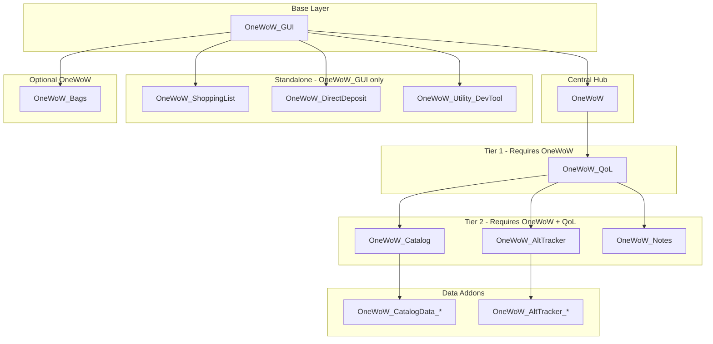
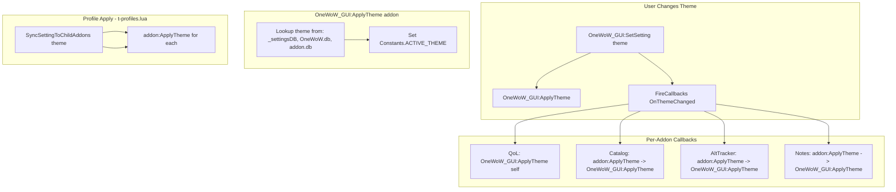
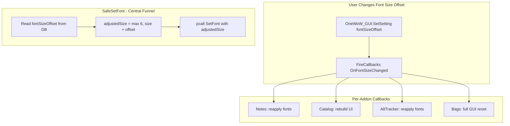

# OneWoW Suite Architecture

Documentation of addon relationships, standalone capability, and cross-addon dependencies in the OneWoW_Suite repository.

---

## 1. Dependency Architecture



---

## 2. TOC Dependency Summary

| Addon | RequiredDeps | OptionalDeps | Standalone? |
|-------|--------------|--------------|-------------|
| **OneWoW_GUI** | (none) | (none) | Yes (base) |
| **OneWoW** | OneWoW_GUI | AltTracker, Catalog, Notes, QoL, DirectDeposit, ShoppingList, Bags, DevTool, Extractor | Yes |
| **OneWoW_QoL** | OneWoW, OneWoW_GUI | (none) | No |
| **OneWoW_Catalog** | OneWoW, OneWoW_QoL, OneWoW_GUI | (none) | No |
| **OneWoW_Notes** | OneWoW, OneWoW_QoL, OneWoW_GUI | (none) | No |
| **OneWoW_AltTracker** | OneWoW, OneWoW_QoL, OneWoW_GUI | (none) | No |
| **OneWoW_ShoppingList** | OneWoW_GUI | OneWoW | Yes |
| **OneWoW_DirectDeposit** | OneWoW_GUI | OneWoW | Yes |
| **OneWoW_Bags** | (none) | OneWoW | Yes |
| **OneWoW_Utility_DevTool** | OneWoW_GUI | (none) | Yes |
| **OneWoW_AltTracker_*** | OneWoW_GUI, OneWoW_AltTracker | (none) | No |
| **OneWoW_CatalogData_*** | OneWoW_GUI, OneWoW_Catalog | (none) | No |

---

## 3. Integration Mechanisms

### 3.1 ModuleRegistry (Hub Tab Embedding)

Addons that appear as tabs in OneWoW's main window register via `OneWoW:RegisterModule()` and `OneWoW:RegisterSettingsPanel()`.

**Used by:** QoL, Catalog, AltTracker, Notes

```lua
_G.OneWoW:RegisterModule({
    name = "catalog",
    displayName = function() return ns.L["ADDON_TITLE_SHORT"] end,
    addonName = "OneWoW_Catalog",
    order = 4,
    tabs = {
        { name = "journal", displayName = ..., create = function(p) ns.UI.CreateJournalTab(p) end },
        -- ...
    },
})
_G.OneWoW:RegisterSettingsPanel({
    name = "catalog",
    displayName = ...,
    order = 3,
    create = function(p) ns.UI.CreateSettingsTab(p) end,
})
```

- **ModuleRegistry** (`OneWoW/Core/ModuleRegistry.lua`) stores `name`, `displayName`, `tabs`, `order`.
- When the user selects a module tab, OneWoW's `GUI/MainWindow.lua` calls `tabInfo.create(frame)` to build content **inside** the hub's content area.
- Content is created lazily and cached in `moduleContentFrames[key]`.
- These addons are **embedded** — they render as tab content when the hub is active.

### 3.2 OneWoW_GUI (Shared UI and Theme)

All addons use `LibStub("OneWoW_GUI-1.0")` for shared UI creation and theme colors. **OneWoW_GUI is required for every addon**, including standalone. Theme is the single source of truth in `OneWoW_GUI_DB`; no addon should maintain its own theme copy.

**OneWoW_GUI Early-Return Convention:** Every Lua file that depends on OneWoW_GUI must include this near the top:

```lua
local OneWoW_GUI = LibStub("OneWoW_GUI-1.0", true)
if not OneWoW_GUI then return end
```

Fail fast. No defensive `if OneWoW_GUI and OneWoW_GUI.SomeMethod then` guards — call methods directly; let errors surface during development.

**Component API Conventions:** All component creation uses `(parent, options)` — parent first, all other parameters in an options table. Example: `OneWoW_GUI:CreateFrame(parent, { name = "MyFrame", width = 400, height = 300, backdrop = Constants.BACKDROP_SOFT })`. See `OneWoW_GUI/GUI.md` for full API reference.

---

## 4. Theme Flow



**Two theme paths:**
- **Settings callback:** User changes theme in OneWoW settings → each addon's `OnThemeChanged` callback runs → `OneWoW_GUI:ApplyTheme`; hub does `GUI:FullReset()`.
- **Profile sync:** User loads a saved profile → `SyncSettingToChildAddons("theme")` in `t-profiles.lua` calls `addon:ApplyTheme()` for each integrated addon.

---

## 4b. Font Size Offset System

All suite addons funnel font application through `OneWoW_GUI:SafeSetFont()`. The font size offset adds a global step (-3 to +5) to every font size passed through this function, letting users scale all text up or down without changing individual element sizes.



**Key details:**
- Stored in `OneWoW_GUI_DB.fontSizeOffset` (default: `0`)
- Range: `-3` to `+5` (enforced in settings UI stepper)
- Minimum final font size: `6px` (floor in `SafeSetFont`)
- Callback event: `OnFontSizeChanged`
- API: `OneWoW_GUI:GetFontSizeOffset()` returns the current offset
- Addons respond to the callback the same way they respond to `OnFontChanged` — reapply fonts and rebuild UI
- The offset preserves design hierarchy: a header at 16px and body at 12px with offset +2 become 18px and 14px

---

## 5. Assumption Verification

| Addon | User Claim | Verified |
|-------|------------|----------|
| **OneWoW_QoL** | Can run standalone if OneWoW optional | **Partially** — TOC requires OneWoW. If made optional: escpanel would show nothing (no errors); vendorpanel would throw errors. |
| **OneWoW_Catalog** | Runs standalone | **CurseForge says yes** — "runs completely standalone." **TOC says no** — RequiredDeps: OneWoW, OneWoW_QoL, OneWoW_GUI. CurseForge packaging may bundle dependencies. |
| **OneWoW_Notes** | Can act standalone | **No** — TOC requires OneWoW, OneWoW_QoL, OneWoW_GUI. CurseForge lists OneWoW as required. |
| **OneWoW_AltTracker** | Cannot run standalone | **Yes** — Requires OneWoW, OneWoW_QoL, OneWoW_GUI. |
| **OneWoW_ShoppingList** | Says requires OneWoW | **TOC says OptionalDeps** — Code has no `_G.OneWoW` references. **Verified standalone.** |
| **OneWoW_DirectDeposit** | Says requires OneWoW | **TOC says OptionalDeps** — Code has no `_G.OneWoW` references. **Verified standalone.** |
| **OneWoW_Bags** | Can act standalone | **Yes** — No RequiredDeps, OptionalDeps: OneWoW. |
| **OneWoW_Utility_DevTool** | Can run standalone | **Yes** — RequiredDeps: OneWoW_GUI only. |

---

## 6. QoL-Specific Issues (Standalone Mode)

### escpanel (portalHub)

- **Location:** `OneWoW_QoL/Modules/external/escpanel/escpanel.lua`
- **Behavior:** Uses `_G.OneWoW.db.global.portalHub` for toggle state. `GetPortalHubDB()` returns nil without OneWoW.
- **Result:** `OnEnable` returns early; no settings sync. No errors, but nothing shows.

### vendorpanel (ItemStatus)

- **Location:** `OneWoW_QoL/Modules/external/vendorpanel/vendorpanel.lua`, `vendorpanel-ui.lua`
- **Behavior:** `GetItemStatus()` returns `_G.OneWoW and _G.OneWoW.ItemStatus`. When OneWoW is absent, returns nil.
- **Problem:** Code calls `GetItemStatus():IsItemProtected(itemID)` etc. without nil checks. When `GetItemStatus()` is nil, this causes "attempt to call nil value" errors.
- **Affected:** `VendorPanel:IsItemInNeverSellList`, `VendorPanel:AddToNeverSellList`, `VendorPanel:RemoveFromNeverSellList`, `VendorPanel:GetNeverSellList`, `VendorPanel:SellJunkItems`, `VendorPanel:GetJunkItemCount`, `VendorPanel:GetDestroyableItemCount`, `VendorPanel:DestroyNextJunkItem`, `VendorPanel:DeleteAllNoValueJunk`, `VendorPanel:AddNonSoulboundReagents`, `VendorPanel:AddConsumables`, `VendorPanel:AddWhiteQuality`, `VendorPanel:AddGearBelowIlvl`, `VendorPanel:GetJunkItemsDetailed`, `VendorPanelModule:OnEnable` (migration, callback registration).

---

## 7. OneWoW Core Assets Used by QoL

| Asset | Location | Usage |
|-------|----------|-------|
| **portalHub** | `OneWoW.db.global.portalHub` | escpanel toggles (escEnabled, escShowTasks, etc.) |
| **ItemStatus** | `OneWoW.ItemStatus` | vendorpanel junk/protected lists, never-sell, sell/destroy logic |

---

## 8. Cross-Addon References

| From | To | Type | Purpose |
|------|-----|------|---------|
| OneWoW_ShoppingList | OneWoW_Catalog | `_G.OneWoW_Catalog_TradeskillAPI` | Recipe callback when Catalog is loaded (ADDON_LOADED check) |
| OneWoW | OneWoW_Bags | Integration | `OneWoW/Integrations/OneWoW_Bags.lua` |

---

## 9. Identified Issues

### OneWoW_Bags — Off-Limits

**Do not modify OneWoW_Bags.** Another developer is actively working on it. Exclude it from migration plans and theme consolidation. See `.cursor/rules/OneWoW-Bags-OffLimits.mdc`.

### TOC / Metadata

- **OneWoW_Utility_Extractor** — Listed in OneWoW OptionalDeps but has no TOC in the repository. Status unknown (may exist elsewhere or be planned). Left as-is since OptionalDeps do not block loading.

### Catalog / Notes Standalone Mismatch

- **Catalog:** CurseForge says "runs completely standalone" but TOC requires OneWoW, OneWoW_QoL, OneWoW_GUI. Either packaging bundles these, or marketing is ahead of implementation.
- **Notes:** CurseForge says OneWoW is required; TOC matches.

---

## 10. Recommendations for Future Standalone Work

- **QoL standalone:** If OneWoW is made OptionalDeps, vendorpanel must guard all `GetItemStatus()` calls with nil checks or provide a fallback (e.g., local item status storage). escpanel can remain as-is (graceful no-op).
- **Catalog/Notes standalone:** Would require TOC changes (OneWoW, OneWoW_QoL → OptionalDeps) and code changes to handle optional QoL/OneWoW. Catalog uses OneWoW_GUI only in code; QoL dependency may be structural (e.g., shared module registry).
- **Documentation:** Align CurseForge descriptions with actual TOC and runtime behavior.

---

## 11. File Reference Summary

| File | Purpose |
|------|---------|
| `OneWoW/Features/itemstatus.lua` | Defines `OneWoW.ItemStatus` |
| `OneWoW/Portals/portalhub.lua` | Defines `OneWoW.db.global.portalHub` |
| `OneWoW_QoL/Modules/external/escpanel/escpanel.lua` | Reads portalHub from OneWoW |
| `OneWoW_QoL/Modules/external/vendorpanel/vendorpanel.lua` | Uses OneWoW.ItemStatus |
| `OneWoW_ShoppingList/Modules/CatalogIntegration.lua` | Optional Catalog integration |
