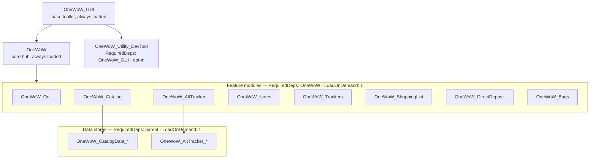
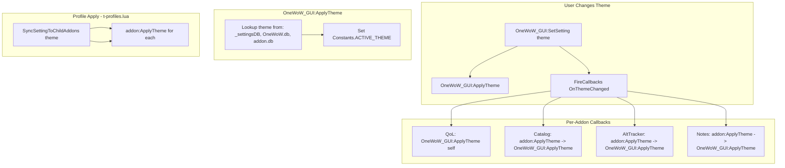
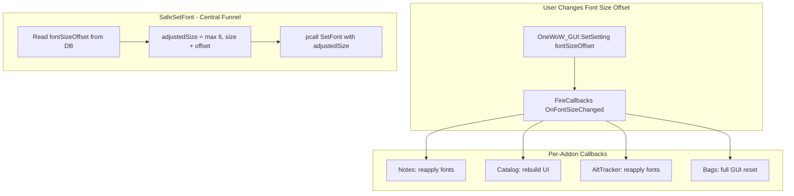

# OneWoW Suite Architecture

Current, implemented architecture of the OneWoW suite: how the load units depend
on each other, how the core loads and initializes them, and the shared
mechanisms they integrate through.

> **Scope:** this document describes *what is implemented today*. Design
> rationale, retired approaches, and future migration steps live in
> [`OneWoW/Docs/Load-Unit-Map.md`](OneWoW/Docs/Load-Unit-Map.md); sections below
> reference it where the "why" matters.

---

## 1. True-core model

The suite ships as separate addons ("load units" / TOCs) but behaves as one
product. `OneWoW_GUI` is the base toolkit and `OneWoW` is the always-loaded core
hub. Every feature module and data store **requires `OneWoW`** and is
`## LoadOnDemand: 1` — nothing auto-loads. The core's orchestrator force-loads
the enabled units at startup and drives their initialization in a deterministic
order (§3). The only units not bound to the core are `OneWoW_GUI` (the base) and
`OneWoW_Utility_DevTool` (an opt-in developer utility that still requires only
`OneWoW_GUI`).


```mermaid
flowchart TB
    GUI[OneWoW_GUI<br/>base toolkit, always loaded]
    OW[OneWoW<br/>core hub, always loaded]
    GUI --> OW

    subgraph Modules [Feature modules — RequiredDeps: OneWoW · LoadOnDemand: 1]
        QoL[OneWoW_QoL]
        Catalog[OneWoW_Catalog]
        AltTracker[OneWoW_AltTracker]
        Notes[OneWoW_Notes]
        Trackers[OneWoW_Trackers]
        ShoppingList[OneWoW_ShoppingList]
        DirectDeposit[OneWoW_DirectDeposit]
        Bags[OneWoW_Bags]
    end
    OW --> Modules

    subgraph Stores [Data stores — RequiredDeps: parent · LoadOnDemand: 1]
        CatalogData[OneWoW_CatalogData_*]
        AltData[OneWoW_AltTracker_*]
    end
    Catalog --> CatalogData
    AltTracker --> AltData

    DevTool[OneWoW_Utility_DevTool<br/>RequiredDeps: OneWoW_GUI · opt-in]
    GUI --> DevTool
```

---

## 2. TOC dependency summary

Verified against the current `.toc` files.

| Load unit | RequiredDeps | OptionalDeps | LoadOnDemand |
|---|---|---|---|
| **OneWoW_GUI** | — | — | 0 (base, always) |
| **OneWoW** | OneWoW_GUI | Auctionator, TradeSkillMaster | — (always) |
| **OneWoW_QoL** | OneWoW, OneWoW_GUI | — | 1 |
| **OneWoW_Catalog** | OneWoW, OneWoW_GUI | OneWoW_AltTracker, OneWoW_AltTracker_Auctions | 1 |
| **OneWoW_AltTracker** | OneWoW, OneWoW_GUI | — | 1 |
| **OneWoW_Notes** | OneWoW, OneWoW_GUI | — | 1 |
| **OneWoW_Trackers** | OneWoW, OneWoW_GUI | OneWoW_Notes, TradeSkillMaster, Auctionator | 1 |
| **OneWoW_ShoppingList** | OneWoW, OneWoW_GUI | — | 1 |
| **OneWoW_DirectDeposit** | OneWoW, OneWoW_GUI | — | 1 |
| **OneWoW_Bags** | OneWoW, OneWoW_GUI | OneWoW_AltTracker, OneWoW_ShoppingList, TradeSkillMaster, Baganator, Masque | 1 |
| **OneWoW_Utility_DevTool** | OneWoW_GUI | !BugGrabber | — |
| **OneWoW_AltTracker_\*** (Storage, Character, Collections, Endgame, Accounting, Professions, Auctions) | OneWoW, OneWoW_GUI, OneWoW_AltTracker | — | 1 |
| **OneWoW_CatalogData_\*** (Journal, Quests, Vendors, Tradeskills) | OneWoW, OneWoW_GUI, OneWoW_Catalog | — | 1 |

---

## 3. Load lifecycle

The core owns both *when* a unit loads and *when* it initializes. This is the
implemented "core-driven load lifecycle"; see Load-Unit-Map §5 for the full
rationale (including why this replaced `LoadWith` / `LoadManagers`).

### 3.1 Orchestrator + manifest

`OneWoW/Core/AddonLoader.lua` holds the authoritative `OneWoW.ModuleManifest`
(every suite unit, its slash command, hub module name, `loadPhase`, and a parent's
`stores`). At the **end of core's `ADDON_LOADED`** (before `PLAYER_LOGIN`),
`OneWoW.LoadOrchestrator:RunStartupPhase()` walks the manifest, `EnsureLoaded`s
each `loadPhase == "login"` module, then `EnsureLoaded`s that module's data
stores. A unit disabled in Blizzard's list (account-wide *or* per-character)
fails `EnsureLoaded` with `"DISABLED"` and is skipped, along with its stores.

### 3.2 `OnAddonLoaded` hook

Because the orchestrator loads units via `C_AddOns.LoadAddOn` from inside core's
own `ADDON_LOADED`, WoW does **not** deliver those units their own `ADDON_LOADED`
event. Instead, `EnsureLoaded` calls `_G[name]:OnAddonLoaded()` synchronously
right after a fresh load. Each unit (the 8 modules + the shared
`DB:BootSubModule` covering all 11 stores) exposes a one-shot, idempotent
`OnAddonLoaded()` that performs its DB setup, and keeps a `PLAYER_LOGIN` handler
with a safety call to the same hook. Result: every DB is built in
core-controlled, dependency order before any `PLAYER_LOGIN` fires.

> Integration code that previously keyed off a force-loaded unit's own
> `ADDON_LOADED` must use `PLAYER_LOGIN` (or the parent's `OnAddonLoaded`) instead,
> since that event is eaten. Current examples: `OneWoW_Bags` overlay refresh hooks
> and AltTracker `actionbars-compat`.

### 3.3 Loader API (`OneWoW/Core/AddonLoader.lua`)

GUI-free, published on the `OneWoW` global, so it loads before the orchestrator
that uses it.

```lua
-- On-demand loading (idempotent; pulls RequiredDeps; returns the raw failure token)
OneWoW:EnsureLoaded(name [, opts])              -> ok, reason?
OneWoW:WithAddon(name, onReady, onFail, opts)   -> ok        -- callback form
OneWoW:GetLoadFailureText(reason)               -> localized string
```

`{ deferInCombat = true }` queues the load to `PLAYER_REGEN_ENABLED` for units
that build secure frames. The same primitive serves the startup orchestrator and
all point-of-use lazy loads — there is one loader. See Load-Unit-Map §5.2.

### 3.4 Enable-state API

The two settings surfaces that read/write Blizzard's per-addon enable flag — the
Home tab (`GUI/t-home.lua`) and Manage Features (`Core/FirstRunWizard.lua`) —
share one implementation here instead of hand-rolling parallel helpers.

```lua
OneWoW:IsAddonEnabled(name, perCharacter)        -> boolean
OneWoW:SetAddonEnabled(name, enabled, perCharacter)
OneWoW:GetAddonStatus(name, perCharacter)        -> status, reason?
```

- **`perCharacter` is the scope, chosen per call site.** Home passes `false`
  (account-wide); Manage Features passes `true` (a current-character override that
  can re-enable a unit disabled account-wide). The two are complementary by design.
- **`GetAddonStatus` treats loaded / `DEMAND_LOADED` as healthy** — every suite
  unit is `LoadOnDemand: 1`, so `GetAddOnInfo` reports `loadable=false,
  reason="DEMAND_LOADED"` even while loaded and working; that is not an error.
- Enable/disable changes take effect on the next reload/relog (WoW cannot
  load/unload addon Lua mid-session). See Load-Unit-Map §5.3.

---

## 4. Cross-unit sharing model

Because modules are separate load units, they cannot share core's private `ns`
table. Sharing happens through globals published by core and the GUI toolkit:

- **Within a load unit:** `local _, ns = ...` (private upvalue table).
- **Across load units:** plain globals — `_G.OneWoW` (set in `OneWoW.lua:5`),
  the `OneWoW_GUI` toolkit (currently via `LibStub("OneWoW_GUI-1.0")`), and
  members like `OneWoW.OverlayEngine`, `OneWoW.ItemStatus`, `OneWoW.CopyPaste`,
  plus per-unit APIs (e.g. `_G.OneWoW_Catalog_TradeskillAPI`,
  `_G.OneWoW_Trackers_API`).

> LibStub is retained for `OneWoW_GUI` and the vendored Ace libs today. Folding
> `OneWoW_GUI` into core and dropping its LibStub registration is a planned step
> (Load-Unit-Map §6.1), not yet implemented.

---

## 5. Integration mechanisms

### 5.1 ModuleRegistry (hub tab embedding)

Modules that appear as tabs in OneWoW's main window register via
`OneWoW:RegisterModule()` and `OneWoW:RegisterSettingsPanel()`.

**Used by:** AltTracker, Catalog, Notes, QoL, Trackers.

```lua
_G.OneWoW:RegisterModule({
    name = "catalog",
    displayName = function() return ns.L["ADDON_TITLE_SHORT"] end,
    addonName = "OneWoW_Catalog",
    order = 4,
    tabs = {
        { name = "journal", displayName = ..., create = function(p) ns.UI.CreateJournalTab(p) end },
        -- ...
    },
})
```

- `ModuleRegistry` (`OneWoW/Core/ModuleRegistry.lua`) stores `name`,
  `displayName`, `tabs`, `order`.
- When a module tab is selected, `OneWoW/GUI/MainWindow.lua` calls
  `tabInfo.create(frame)` to build content **inside** the hub's content area.
- Content is created lazily and cached in `moduleContentFrames[key]`.

Standalone-window modules (Bags, ShoppingList, DirectDeposit) open their own
frames via slash commands rather than embedding a hub tab.

### 5.2 OneWoW_GUI (shared UI and theme)

All addons use `LibStub("OneWoW_GUI-1.0")` for shared UI creation and theme
colors. Theme is the single source of truth in `OneWoW_GUI_DB`; no addon keeps
its own copy.

**Early-return convention** — every file that depends on OneWoW_GUI starts with:

```lua
local OneWoW_GUI = LibStub("OneWoW_GUI-1.0", true)
if not OneWoW_GUI then return end
```

Fail fast — no defensive `if OneWoW_GUI and OneWoW_GUI.SomeMethod then` guards.

**Component API:** all creation uses `(parent, options)`. See `OneWoW_GUI/GUI.md`
for the full reference, and Load-Unit-Map / the `onewow-gui-ui` skill for policy.

**Database API:** `OneWoW_GUI.DB` provides SavedVariable utilities
(`MergeMissing`, `Ensure`, `Read`, `Set`, `Init`, `RunMigrations`). See the
`onewow-database-api` skill for the full surface.

### 5.3 Theme flow


```mermaid
flowchart TB
    subgraph SettingsChange [User Changes Theme]
        SetSetting[OneWoW_GUI:SetSetting theme]
        SetSetting --> ApplyThemeLib[OneWoW_GUI:ApplyTheme]
        SetSetting --> FireCallbacks[FireCallbacks OnThemeChanged]
    end

    subgraph OneWoW_GUI_ApplyTheme [OneWoW_GUI:ApplyTheme]
        Lookup[Lookup theme from: _settingsDB, OneWoW.db, addon.db]
        Lookup --> SetActive[Set Constants.ACTIVE_THEME]
    end

    subgraph AddonCallbacks [Per-Addon Callbacks]
        QoL[QoL: OneWoW_GUI:ApplyTheme self]
        Catalog[Catalog: addon:ApplyTheme -> OneWoW_GUI:ApplyTheme]
        AltTracker[AltTracker: addon:ApplyTheme -> OneWoW_GUI:ApplyTheme]
        Notes[Notes: addon:ApplyTheme -> OneWoW_GUI:ApplyTheme]
    end

    subgraph ProfileSync [Profile Apply - t-profiles.lua]
        Sync[SyncSettingToChildAddons theme]
        Sync --> AddonApply[addon:ApplyTheme for each]
    end

    FireCallbacks --> QoL
    FireCallbacks --> Catalog
    FireCallbacks --> AltTracker
    FireCallbacks --> Notes
    Sync --> AddonApply
```

Two paths:
- **Settings callback:** user changes theme → each addon's `OnThemeChanged`
  callback runs → `OneWoW_GUI:ApplyTheme`; the hub does `GUI:FullReset()`.
- **Profile sync:** user loads a saved profile → `SyncSettingToChildAddons("theme")`
  in `t-profiles.lua` calls `addon:ApplyTheme()` for each integrated addon.

### 5.4 Font size offset

All suite addons funnel font application through `OneWoW_GUI:SafeSetFont()`. A
global offset (-3 to +5) is added to every size passed through it, scaling all
text without changing individual element sizes.


```mermaid
flowchart TB
    subgraph SettingsChange [User Changes Font Size Offset]
        SetOffset[OneWoW_GUI:SetSetting fontSizeOffset]
        SetOffset --> FireCB[FireCallbacks OnFontSizeChanged]
    end

    subgraph SafeSetFont [SafeSetFont - Central Funnel]
        ReadOffset[Read fontSizeOffset from DB]
        ReadOffset --> CalcSize[adjustedSize = max 6, size + offset]
        CalcSize --> ApplyFont[pcall SetFont with adjustedSize]
    end

    subgraph AddonCallbacks [Per-Addon Callbacks]
        Notes2[Notes: reapply fonts]
        Catalog2[Catalog: rebuild UI]
        AltTracker2[AltTracker: reapply fonts]
        Bags2[Bags: full GUI reset]
    end

    FireCB --> Notes2
    FireCB --> Catalog2
    FireCB --> AltTracker2
    FireCB --> Bags2
```

Key details:
- Stored in `OneWoW_GUI_DB.fontSizeOffset` (default `0`); range `-3`..`+5`
  (enforced in the settings stepper); minimum final size `6px`.
- Callback event `OnFontSizeChanged`; `OneWoW_GUI:GetFontSizeOffset()` returns it.
- Addons respond as they do to `OnFontChanged` — reapply fonts / rebuild UI.

---

## 6. Cross-addon references

| From | To | Mechanism | Purpose |
|---|---|---|---|
| OneWoW | OneWoW_Bags | `OneWoW/Integrations/OneWoW_Bags.lua` | Registers the overlay engine with Bags' item-button callbacks |
| OneWoW_ShoppingList | OneWoW_Catalog | `_G.OneWoW_Catalog_TradeskillAPI` | Recipe callback when Catalog's tradeskill data is loaded |
| OneWoW_Trackers | OneWoW_Notes | `_G.OneWoW_Trackers_API` | Trackers exposes an API; Notes adds a tracker sub-tab |
| OneWoW_Trackers | OneWoW_Notes_DB | One-time migration | Migrates legacy tracker data out of Notes' SavedVariables |

---

## 7. File reference summary

| File | Purpose |
|---|---|
| `OneWoW/Core/AddonLoader.lua` | Load orchestrator, `ModuleManifest`, `EnsureLoaded`/`WithAddon`, enable-state API |
| `OneWoW/Core/ModuleRegistry.lua` | Hub tab/module registration and lifecycle |
| `OneWoW/Core/FirstRunWizard.lua` | First-run picker + Manage Features panel (per-character enable/disable) |
| `OneWoW/GUI/t-home.lua` | Home tab: account-wide enable/disable + status display |
| `OneWoW/GUI/MainWindow.lua` | Hub window; builds registered module tabs lazily |
| `OneWoW/Docs/Load-Unit-Map.md` | Design rationale, retired mechanisms, and future migration steps |
